# SORACOM LTE-M Button for Enterprise の位置情報を SORACOM Harvest と SORACOM Funk に連携して可視化と通知を行う

## Overview
Duration: 1:00

以下の内容について解説します。

- SORACOM LTE-M Button for Enterprise （以下、Enterprise Button） の登録
- Enterprise Button のクリックされた位置とクリック種別（シングルクリック、ダブルクリック、長押し）を SORACOM Harvest（以下、Harvest） に保存、可視化する方法
- Enterprise Button のクリックされた情報を SORACOM Funk（以下、Funk） と連携し、Slack に通知する方法
- 簡易位置測位機能、Harvest 、Funk の解約方法  


Negative
: **注意！** このハンズオンの内容には有料のサービスが含まれます。自身のアカウントで実施される場合は料金をご確認の上実施してください。

### ■ 目安となる料金

Enterprise Button をお持ちであれば 約 100 円で実施できます。内訳は以下となります(2019 年 7 月 1 日 現在、税・送料別)。

- SORACOM LTE-M Button for Enterprise 購入料金: **5,980 円** (参考 [https://soracom.jp/products/gadgets/enterprise_button/](https://soracom.jp/products/gadgets/enterprise_button/) )
- SORACOM Air SIM(plan-KM1) 利用料金 (参考 [https://soracom.jp/services/air/cellular/price/#plan-km1](https://soracom.jp/services/air/cellular/price/#plan-km1))
  - 基本料金: **100 円 / 月**
  - データ通信: **0.5 円 / KB**
- SORACOM Harvest 利用料金 (参考 [https://soracom.jp/services/harvest/price/](https://soracom.jp/services/harvest/price/))
  - Harvest 利用オプション: **5 円 / 日** (無料利用枠あり)
  - 書き込みリクエスト: **0.004 円 / リクエスト** (無料利用枠あり)
- SORACOM Funk 利用料金 (参考 [http://soracom.jp/services/funk/price/](http://soracom.jp/services/funk/price/))
  - 1 リクエスト: **0.0018 円 / リクエスト** (無料利用枠あり)
- 簡易位置測位機能 利用料金
  - 利用オプション: **50 円 / 月** (予定)

## 必要なもの
Duration: 1:00

このドキュメントを進めるにあたり以下のデバイスが必要となります。

- SORACOM LTE-M Button for Enterprise (本ハンズオンではソラコムからの貸与となります)

このドキュメントを進めるにあたり以下のアカウントが必要となります。

- SORACOM (本ハンズオンではソラコムからの貸与となります)
- AWS
- Slack

このドキュメントを進めるにあたり以下の知識が必要となります。

- AWS Lambda (Node.js のサンプルコードは用意しています)
- Slack Webhook (スクリーンショット付きのチュートリアルは用意しています)

## ユーザーコンソールへログインする
Duration: 1:00

[SORACOM ユーザーコンソール](https://console.soracom.io/#/?coverage_type=jp)へアクセスします。ログイン画面が表示されるので、ボタンに付属しているカードに記載されているメールアドレスとパスワードを入力し、 [ログイン] ボタンをクリックしてください。  


以下のような「SIM 管理」画面が表示されたらログイン完了です。  

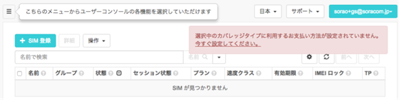

## Harvest に Enterprise Button の位置情報とクリックタイプを保存する

Duration: 20:00

Enterprise Button から Harvest に対して位置情報とクリックタイプを保存する方法を解説します。

### ■ グループを作成し、Enterprise Button を所属させる

1. [ユーザーコンソール](https://console.soracom.io) の "Menu" から "SIM グループ" を選択します。  
   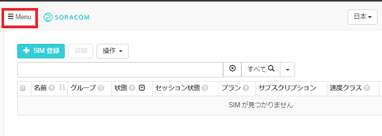
   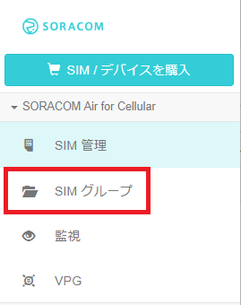
2. "グループを作成する" (グループが存在しない場合) あるいは "追加" ボタンよりグループを作成します。任意の名前 (たとえば "handson-button") をつけて "グループ作成" ボタンをクリックします。  
   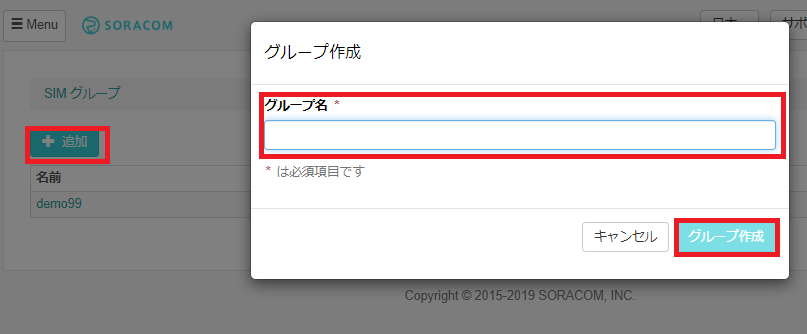
3. "Menu" から "SIM 管理" を選択します。  
   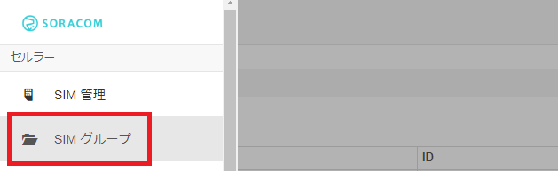
4. Enterprise Button の SIM の左端にある チェックボックスを選択し、"操作" => "所属グループ変更" を選択します。  
   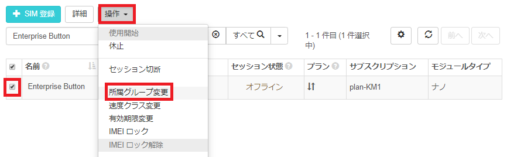
5. "新しい所属グループ" に作成したグループを選択し、"グループ変更" をクリックします。  
   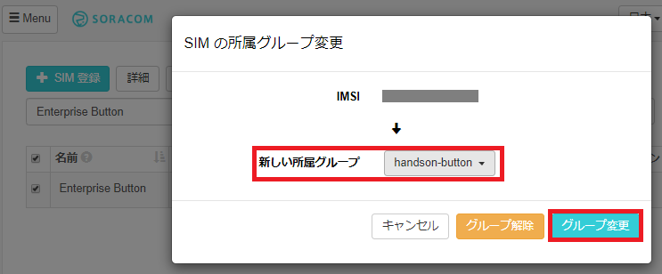

### ■ Harvest の利用を開始する

1. 所属させたグループの名前をクリックし、グループ設定の変更画面に遷移します。  
   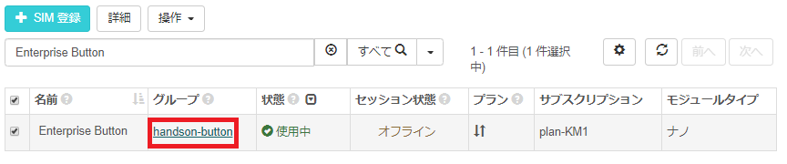
2. ”SORACOM Harvest 設定" を開き、"OFF" となっているスイッチをクリックして "ON" に変更します。"保存" をクリックすれば、Harvest が有効となります。ポップアップされる注意事項では "OK" をクリックします。**"保存" をクリックしないと設定が変更されないのでご注意ください。**  
   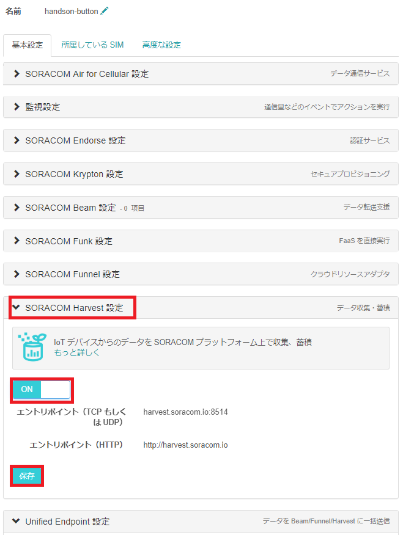

### ■ 簡易位置測位機能の利用を開始する

"SORACOM Air for Cellular 設定" を開き、"簡易位置測位機能" を "ON" に変更し、"保存" をクリックします。  
   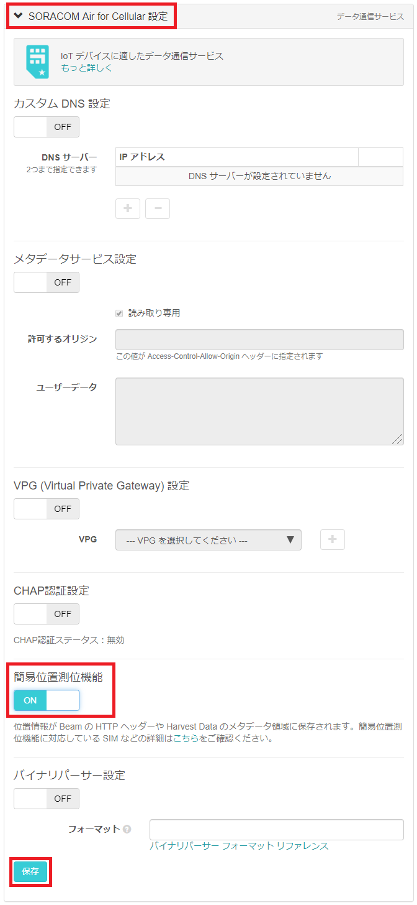


### ■ バイナリパーサー を設定する

"SORACOM Air for Cellular 設定" を開き、"バイナリパーサー設定" を "ON" に変更し、フォーマットに `@button` と記載し、"保存" をクリックします。  
   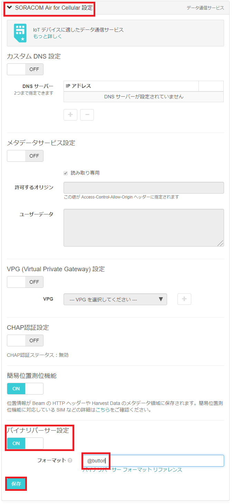

### ■ Enterprise Button を押して Harvest を確認する

いよいよ Enterprise Button を押します。ボタンをクリックし、 LED がオレンジ色となり、数秒後に緑色となればデータの送信は成功です。  
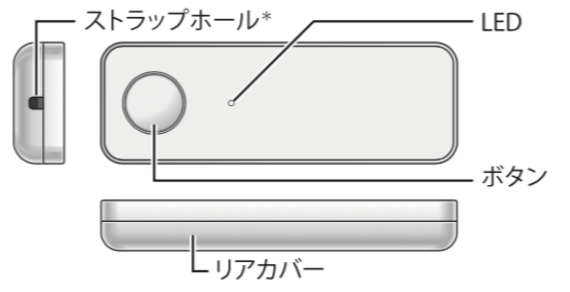

Harvest 上のデータを以下の手順で確認します。

1. "Menu" から "SIM 管理" を選択します。  
   
2. Enterprise Button の SIM の左端にある チェックボックスを選択し、"操作" => "データを確認" を選択します。  
   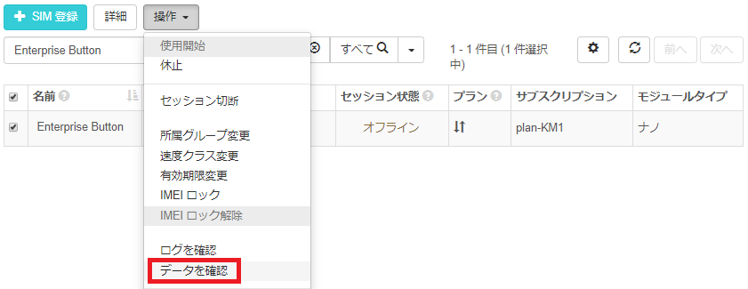
3. "データ" 列にて、"clickTypeName" が "SINGLE" であることを確認します。  
   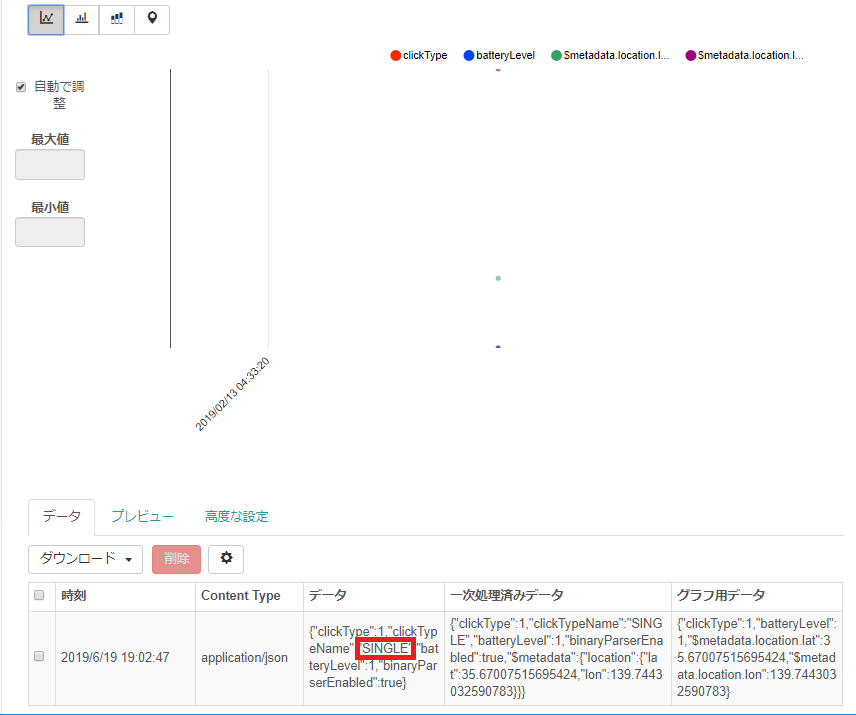
4. マップピンアイコンを選択することで表示を地図に変更して、位置情報を確認します。左上の "+" や "-" でズームを調整できます。"データ" にも `$metadata.location` オブジェクトとしてで位置情報が入っています。  
   
5. Enterprise Button は以下 3 種類のクリックに対応しています。それぞれぜひ試してみてください。連続してデータの送信をしたい場合は Harvest の画面にて「自動更新」を "ON" にしてみてください。  
   - シングル: 短く(1.2 秒未満) 1 回押す
   - ダブル: 2 秒以内にシングルクリックを 2 回行う
   - ロング: 1.2 秒以上押し続ける。

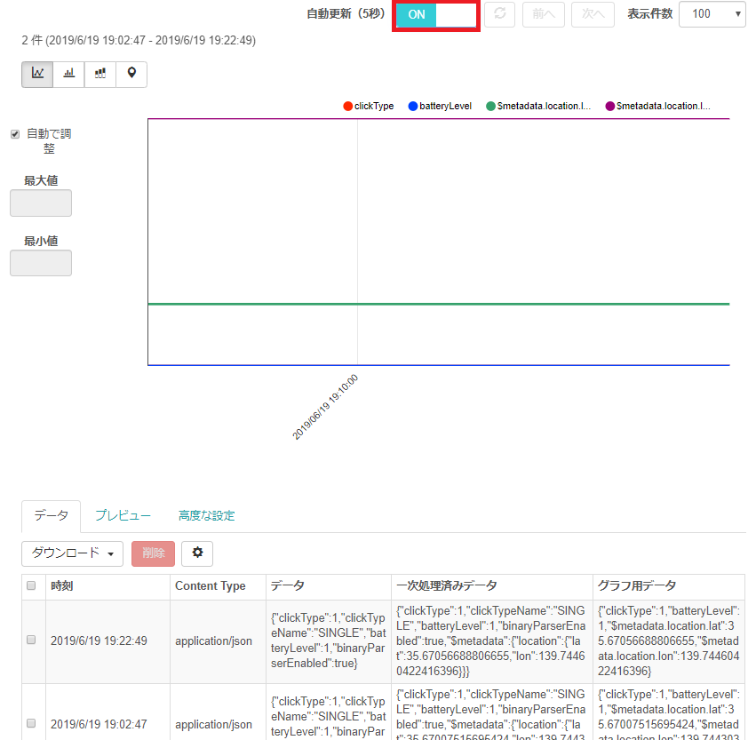

## Funk で位置情報とクリックタイプを Slack に通知する

Duration: 20:00

Enterprise Button から Funk を介して AWS Lambda にクリックされた位置の情報とクリックタイプを連携し、Slack へ通知する方法を解説します。

### ■ Slack を設定する

**当ハンズオンは Slack アカウントをお持ちの方と Slack Webhook について知識のある方を対象にしているため、この節の詳細は解説しません。**

必要に応じて Slack への[ユーザー登録](https://slack.com/get-started)を行ってください。
Slack の Incoming Webhook を有効にし、Webhook URL を控えておきます。下の画像は Microsoft Store 版 Slack のスクリーンショットを載せています。


---


---

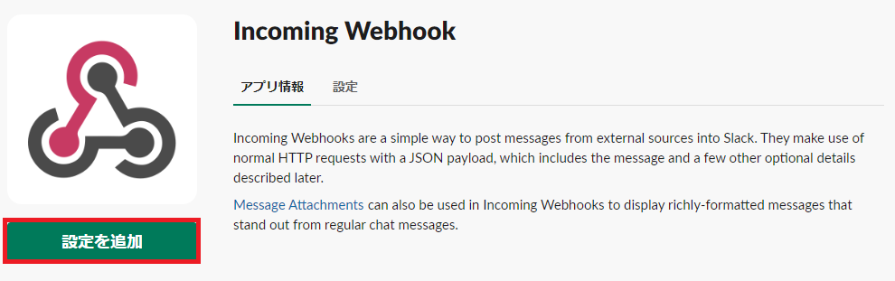

---


---


### ■ AWS Lambda を設定する

**当ハンズオンは AWS アカウントをお持ちの方と AWS Lambda について知識のある方を対象にしているため、この節の詳細は解説しません。**

1. [AWS Lambda 管理コンソール](https://ap-northeast-1.console.aws.amazon.com/lambda/home?region=ap-northeast-1#/create) を開きます。  
2. 任意の関数名をつけ、ランタイムに "Node.js 10.x" を選択、実行ロールに "基本的な Lambda アクセス権限で新しいロールを作成" とし "関数の作成" を選択します。  
   
3. 以下のコードをコードエディタの `index.js` として貼り付けます。

    ````js
    const https = require("https");
    const url = require("url");
    const slackUrl = process.env.SLACK_URL;

    exports.handler = function(e, ctx, cb) {
        console.log("event: %j", e);
        console.log("context: %j", ctx);

        if (!e.clickTypeName) {
        cb(false, {
            result: "ng",
            reason: "invalid payload: " + JSON.stringify(e)
        });
        }

        var slackReqOptions = url.parse(slackUrl);
        slackReqOptions.method = "POST";
        slackReqOptions.headers = { "Content-Type": "application/json" };
        var payload = {
        icon_emoji: ":button:",
        text: `ボタンが *${
            e.clickTypeName
        }* クリックされました！ (バッテリーレベルは *${e.batteryLevel *
            100}* % です)`,
        attachments: [
            {
            title: "clientContext",
            color: "#34cdd7",
            text:
                "```\n" + JSON.stringify(ctx.clientContext, null, "  ") + "```\n",
            mrkdwn_in: ["text"]
            },
            {
            title: "event",
            color: "#e47911",
            text: "```\n" + JSON.stringify(e, null, "  ") + "```\n",
            mrkdwn_in: ["text"]
            }
        ]
        };
        if (ctx.clientContext.locationQueryResult === "success") {
        payload.attachments.push({
            title: "location",
            color: "#800080",
            text: `<https://www.google.com/maps/search/?api=1&query=${
            ctx.clientContext.location.lat
            },${ctx.clientContext.location.lon}|位置情報あり> ${
            ctx.clientContext.location.lat
            },${ctx.clientContext.location.lon}`
        });
        }
        var body = JSON.stringify(payload);
        slackReqOptions.headers = {
        "Content-Type": "application/json",
        "Content-Length": Buffer.byteLength(body)
        };
        var req = https.request(slackReqOptions, function(res) {
        if (res.statusCode === 200) {
            console.log("Posted to slack");
            cb(null, { result: "ok" });
        } else {
            cb(false, {
            result: "ng",
            reason: "Failed to post slack " + res.statusCode
            });
        }
        return res;
        });
        req.write(body);
        req.end();
    };
    ````

4. 環境変数 `SLACK_URL` に先ほど設定した Slack の Webhook URL を貼り付けて "保存" をクリックします。  
   

5. Lambda の ARN をコピーします。  
   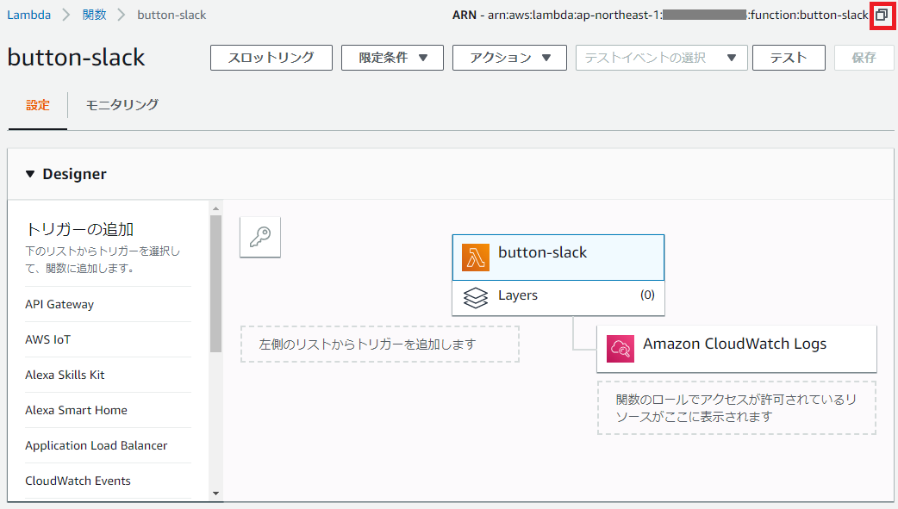

### ■ Lambda 実行用の AWS IAM ユーザーを作成する

1. IAM ポリシー を作成します。詳細は解説しませんが、こちらの JSON に先ほどコピーした Lambda の ARN を入れて利用ください。

   ```json
   {
     "Version": "2012-10-17",
     "Statement": [
       {
         "Effect": "Allow",
         "Action": "lambda:InvokeFunction",
         "Resource": "先ほどコピーしたARN"
       }
     ]
   }
   ```

   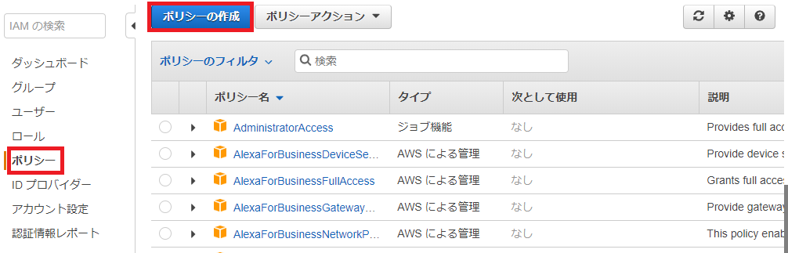  
     
     

2. 作成した IAM ポリシーをアタッチしたユーザーを作成します。タグは不要です。  
   
   
3. 作成したユーザーのアクセスキー ID およびシークレットアクセスキーをコピーします。  
   

### ■ AWS IAM ユーザーの認証情報を SORACOM に登録する

1. SORACOM ユーザーコンソールの右上のユーザー名をクリックし、"セキュリティ" を選択します。  
   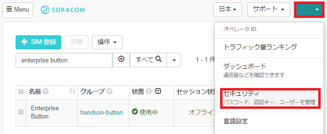
2. "認証情報ストア" => "認証情報を登録" を選択します。  
   
3. "認証情報 ID" は任意に記載し、先ほどコピーした AWS ユーザーのアクセスキー ID およびシークレットアクセスキーを入力し、"登録" をクリックします。  
   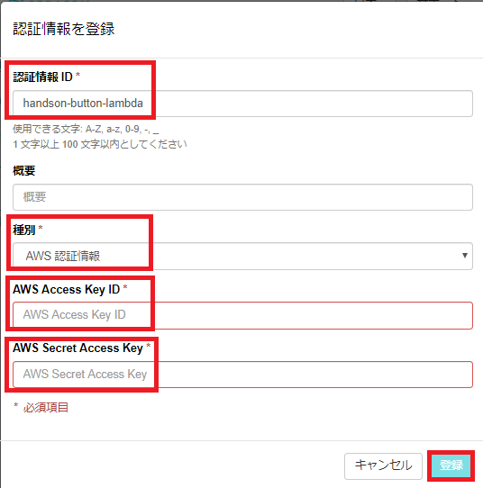

### ■ Funk を設定する

1. ユーザーコンソールの "SIM 管理" メニューより、作成した SIM のグループ名を選択します。  
   
2. "SORACOM Funk 設定" を開き、"ON" にし、先ほど登録した認証情報やコピーした Lambda の ARN を入力して "保存" をクリックします。  
   

### ■ Enterprise Button を押して slack 通知を確認する

以下のような通知が確認できます。  

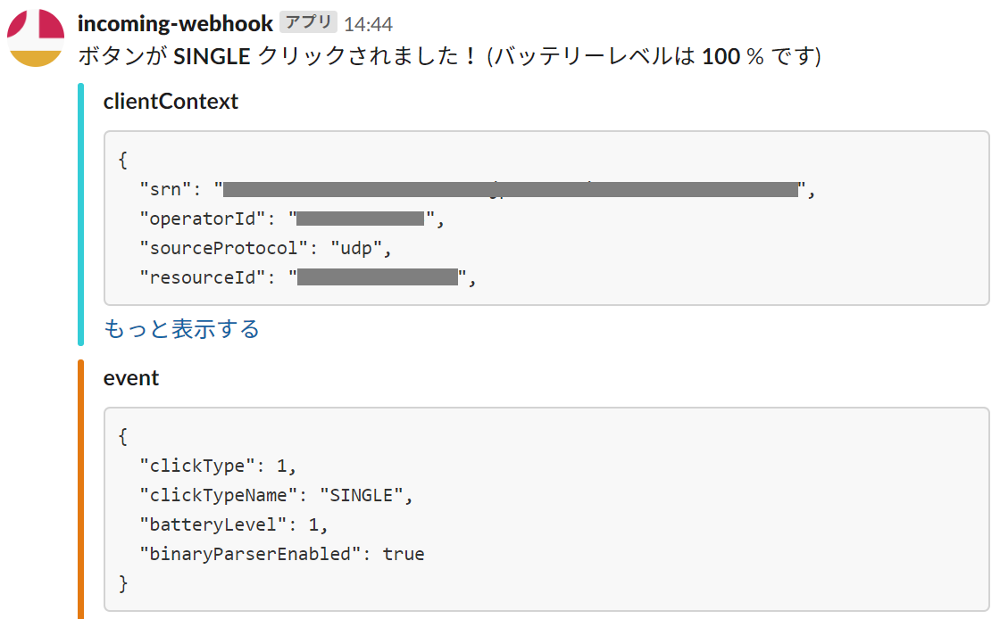

確認できない場合は、Lambda のメトリックにて「ログが出ているか」「エラーが出ていないか」を確認してください。

## サービスの解除と課金の停止

Duration: 10:00

簡易位置測位機能、Harvest、Funk を有効にしたグループ配下に SIM があると基本使用料金が発生します。詳細は [目安となる料金](#目安となる料金) の章をご確認さい。
これらを解約したい場合は、それぞれの機能についてグループで無効化します。

1. ユーザーコンソールの ["SIM 管理" メニュー](https://console.soracom.io/#/?coverage_type=jp)より、作成した SIM のグループ名を選択します。  
   
2. "SORACOM Funk 設定" を開き、"OFF" にし "保存" をクリックします。  
   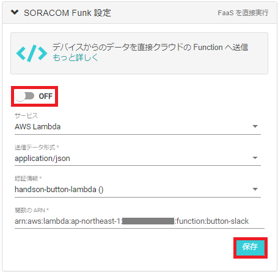
3. "SORACOM Harvest 設定" を開き、OFF にし "保存" をクリックします。  
   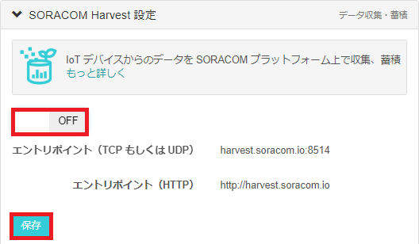
4. "SORACOM Air for Cellular 設定" を開き、"簡易位置測位機能" および "バイナリパーサー設定" を "OFF" にし "保存" をクリックします。 5.[ユーザーコンソール](https://console.soracom.io) から 対象の SIM のチェックボックスを選択 => "操作" => "所属グループ変更" を選択します。  
   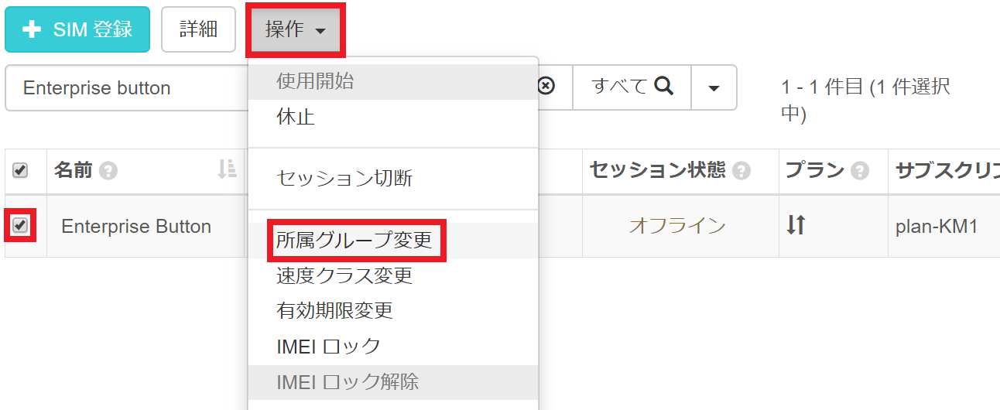
5. "グループ解除" を選択します。  
   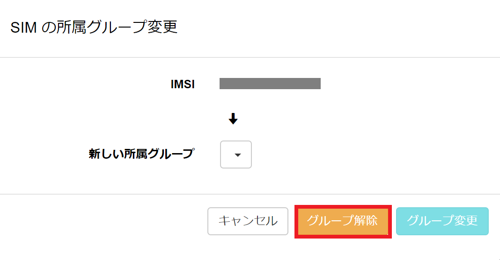
