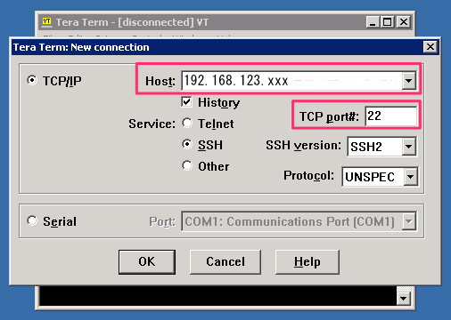
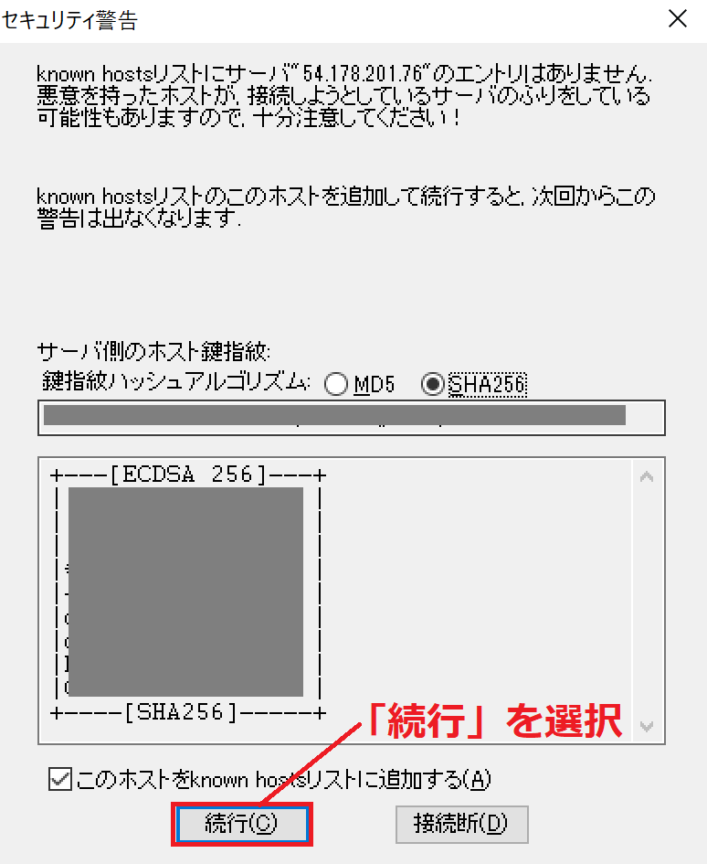
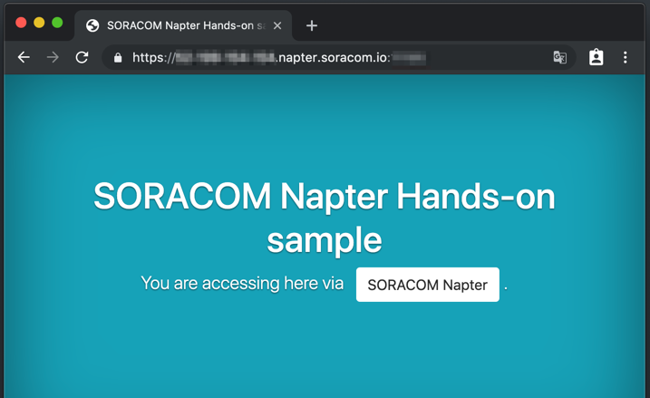

# SORACOM Napter ハンズオン

<h2 id="overview">ハンズオン概要</h2>

SORACOM Air SIM を利用してモバイル通信をしているデバイスに対して、 SSH や RDP, VNC だけでなく、デバイス上で動作している HTTP サーバに対して安全にリモートアクセスを実現する [SORACOM Napter](https://soracom.jp/services/napter/) を体験できるハンズオンです。

※ SSH(Secure Shell), RDP(Remote Desktop Protocol), VNC(Virtual Network Computing) いずれも、遠隔にあるコンピュータをセキュアに操作することができるプロトコル。

### ハンズオンのゴール

"オンデマンドリモートアクセス" SORACOM Napter を利用して、PC からインターネットを経由して SORACOM Air SIM によるモバイル通信をしている Raspberry Pi 上の SSH および Web サーバにアクセスします。


### SORACOM Napter とは？

SORACOM Napterはセキュリティを担保した状態でAir SIMを使用したデバイスへのリモートアクセスを提供します。デバイスにエージェントをインストールすることなく、また既にAir SIMをご利用のIoTデバイスに設定を追加して利用できます。SORACOM Napterでは必要なときのみリモートアクセスを許可し、いつでもリモートアクセスを止めることが可能です。例えば、以下のような用途で利用できます。

- リモートからデバイスにアクセスし、デバイスの設定変更など管理したい
- デバイスの管理画面（HTTP/HTTPS）を遠隔から操作/閲覧したい

<h2 id="check">ハンズオンに必要なもの（持ち物のご確認）</h2>

* 外部の Wi-Fi に接続できる PC
    * OS は問いません
    * 最新の Google Chrome が利用でき、プロキシサーバ設定などが変更可能なもの)
    * SSH クライアント: TeraTerm(Windows), Terminal.app(macOS) など
* クレジットカード x 1
    * SORACOM アカウントをお持ちでない方は、当日アカウントを作成する際にクレジットカードが必要になります
    * デビットカード、プリペイドカードはご利用いただけません。
* 当日利用するPCで SORACOM から受信する内容をその場で確認できるメールアドレス
    * アカウント作成のためにメールアドレス認証が必要です
* SORACOM Air SIM x 1
* SIM アダプタ (nano → micro) x 1
 
### ハンズオン運営からお貸しするもの (要返却)

* リモートアクセス先の Raspberry Pi x 1
* USB ドングル x 1

※ リモートアクセス先の Rasbperry Pi の構成については [Appendix: RPi の構成](#a-rpi) をご覧ください。

<h2 id="index">作業: 目次</h2>

* [SORACOM アカウント作成](#w1)
* [SORACOM Air SIM の登録と SIM の挿入](#w2)
* [SORACOM Napter 設定](#w3)
* [リモートアクセスをする](#w4)
* [あとかたづけ](#clean-up)

<h3 id="w1">SORACOM アカウント作成</h3>

[SORACOM ウェブサイト](https://soracom.jp/)から、User Consoleをクリックします。


アカウントを作成をクリックします。


「カバレッジタイプJapan」を選択します。


必要事項を入力します。


入力が終了したら「アカウントを作成」をクリックします。


メール送信完了のメッセージが表示されますので、メールの到着をお待ちください。


メールが届いたらリンクをクリックしてください。自動的にログイン画面に遷移します。


通信料の支払い方法はクレジットカード払いとなります(法人のお客様は請求書払いにも対応しています)。クレジットカードの情報を登録するには、メイン画面右上のユーザー名が表示されているボタンから [お支払い方法設定] をクリックします。


入力画面が表示されたら、入力フォームに沿ってクレジットカード情報を入力します。最後に[登録] ボタンをクリックすると支払い方法の登録完了です。

<h3 id="w2">SORACOM Air SIM の登録と SIM の挿入</h3>

左上の [SIM 登録] ボタンをクリックします。


「SIM 登録」画面が表示されたら、Air SIM の台紙の裏面に貼ってある IMSI と PASSCODE を入力してください。


名前、グループは空欄のままでも構いません。[登録] を押して SIM 登録を完了してください。[キャンセル] を押して登録画面を閉じます。

SIMをカードから取り外しドングルのカバーを外してセット、ドングルをRaspberry Piの任意のUSBポートに挿して電源を繋ぎます。しばらく待ち、SIM一覧から当該SIMの [セッション状態] が「オンライン」になったら接続完了です。

<h3 id="w3">SORACOM Napter 設定</h3>

NapterでSSH(22番ポート)とWebサーバー(80番ポート)にリモートアクセスする設定を以下の手順で追加します。Webサーバーで用いるHTTPプロトコルは暗号化の仕組みがないため、NapterでTLS暗号化を設定しHTTPSプロトコルによるセキュアなリモートアクセス設定にします。

SORACOM ユーザーコンソールの左上 [Menu] から [SIM 管理] をクリックし、 「操作」 - 「オンデマンドリモートアクセス」を選択します。


「オンデマンドリモートアクセス」画面では、リモートアクセスするデバイス側ポートの接続設定やリモートアクセスを許可するアクセス元IPアドレス帯域などを設定します。今回はSSHのポート番号 `22` 、接続時間30分(どちらも既定値)のまま [OK] をクリックします。


画面が切り替わり「オンデマンドリモートアクセスが正常に構成されました」とメッセージが表示されたら、 [全てのリモート接続設定を表示] ボタンを押します。


続けて [作成] ボタンを押し、Webサーバーの設定を追加する画面を表示します。


今度は [TLS] のチェックボックスをオンにし、 [デバイス側ポート] に `80` を入力、 [OK] ボタン、 [全てのリモート接続設定を表示] ボタンを続けて押します。


オンデマンドリモートアクセス画面に表示される80番ポート、22番ポートの [アクセス] 列にある `xx-xx-xx-xx.napter.soracom.io:12345` のうち `:` の前をホスト名、後ろをアクセスポート番号としてそれぞれコピーしておきます。


<h3 id="w4">リモートアクセスをする</h3>

<h4 id="w4-1">Windows をお使いの場合</h4>

**お手持ちのPCがMacの場合はこの手順を飛ばしてください**

NapterでのSSH接続を試します。今回はSSHクライアントとしてTera Termを利用します。他のSSHクライアントをお使いの方は設定項目をお使いのSSHクライアントの項目に読み替えてください。

Tera Termを起動して以下の項目を入力、 [OK] ボタンを押します。

- ホスト(Host) : Napterの22番ポートのホスト名
- TCPポート#(TCP port#) : Napterの22番ポートのアクセスポート番号



サーバー認証の画面に続いてユーザー認証画面が表示されたら、以下を入力しログインします。セキュリティ警告が出たら「続行」を選択してください。

- ユーザ名 : `pi`
- パスフレーズ : `raspberry`




任意のコマンドを実行し、リモートアクセスできることを確認してください。

<h4 id="w4-2">Mac をお使いの場合</h4>

**お手持ちのPCがWindowsの場合はこの手順を飛ばしてください**

NapterでのSSH接続をMacから試します。Terminal( [Launchpad] - [その他] - [Terminal] )などお使いの端末を起動します。コマンドラインに以下を入力し、接続します。

```
$ ssh -p <Napterの22番ポートのアクセスポート番号> pi@<Napterの22番ポートのホスト名>
例 : ssh -p 12345 pi@xx-xx-xx-xx.napter.soracom.io
```

接続に成功するとサーバー証明書を確認する質問が返ってくるので、 `yes<Enter>` と入力します。続いて `pi` ユーザーのパスワードを聞かれるので、 `raspberry<Enter>` と入力しログインできれば完了です。任意のコマンドを実行し、リモートアクセスできることを確認してください。

<h4 id="w4-3">共通</h4>

NapterでのWebブラウザからの接続を試します。Webブラウザを開き、アドレス欄に以下を入力しアクセスします。

```
https://<Napterの80番ポートのホスト名>:<Napterの80番ポートのアクセスポート番号>
例 : https://xx-xx-xx-xx.napter.soracom.io:12345
```

Webブラウザの画面に以下が表示されればリモートアクセス成功です。アドレズ欄の左側にある鍵のアイコンをクリックし、正常にTLS暗号化されていることを確認します。



以上でリモートアクセスの手順は完了です。

<h2 id="clean-up">作業: あとかたづけ</h2>

Napterの設定は `アクセス可能時間` が経過すると自動で削除されます。Raspberri Piのターミナル上で `sudo poweroff` と実行し、Raspberry Piをシャッドダウンします。シャットダウン後ドングルとSIMを取り出し、SIMはお持ち帰りください。

## Appendix

<h3 id="a-rpi">RPi の構成</h3>

リモートアクセス用に用意した Raspberry Pi (以下、 RPi) は以下のようにされています。  
SORACOM Napter 用の構成は特にありません。

* OS: Raspbian Buster Lite (2019-06-20)
    * SSH
        * OS 起動時の自動立ち上げ
    * Webサーバー
        * Apache、 PHP のインストールと `index.php` や関連ファイルの配置
        * OS 起動時の自動立ち上げ
    * SORACOM Air への接続設定
        * [setup_air.sh](https://soracom-files.s3.amazonaws.com/setup_air.sh) の実行

[EoT]
