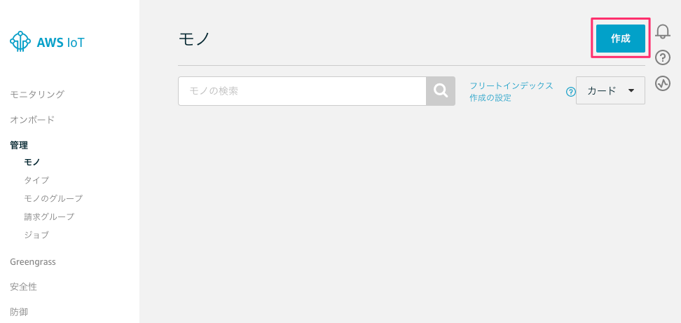
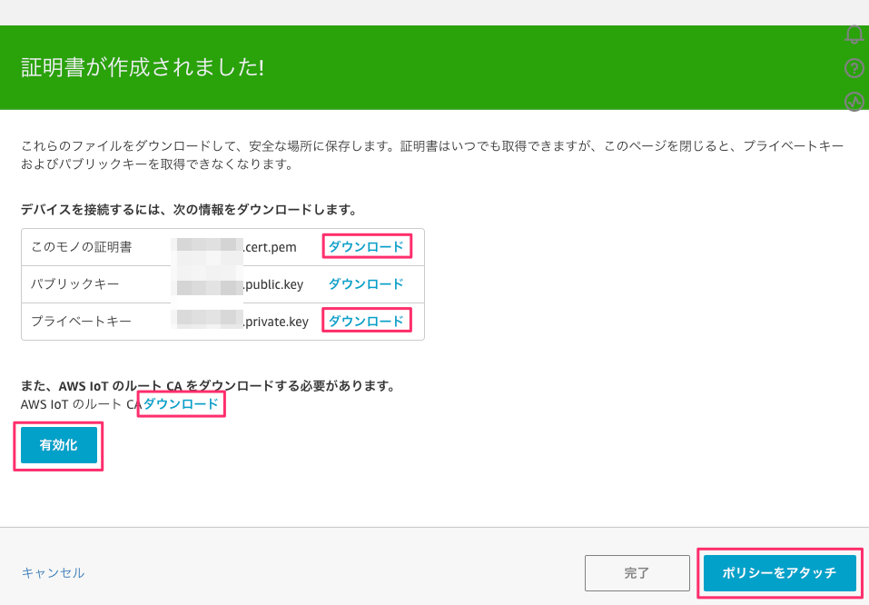
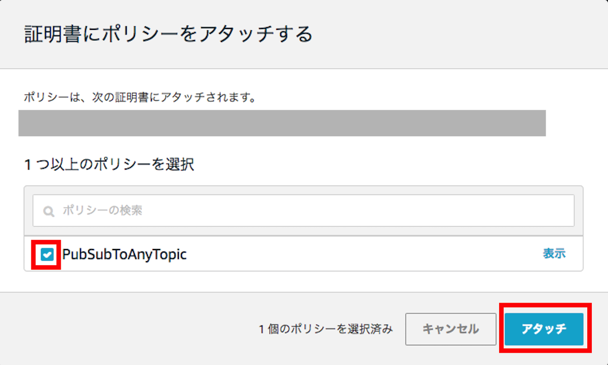
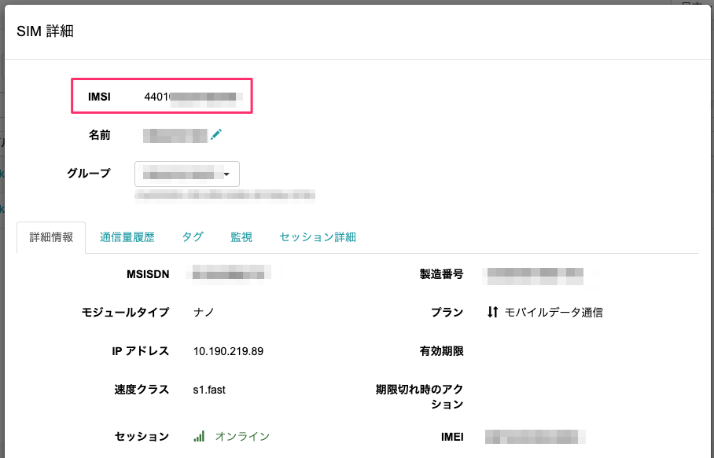
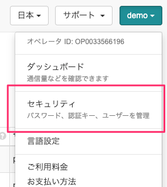
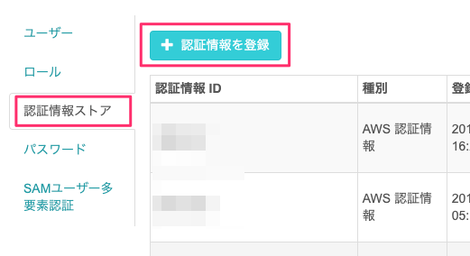
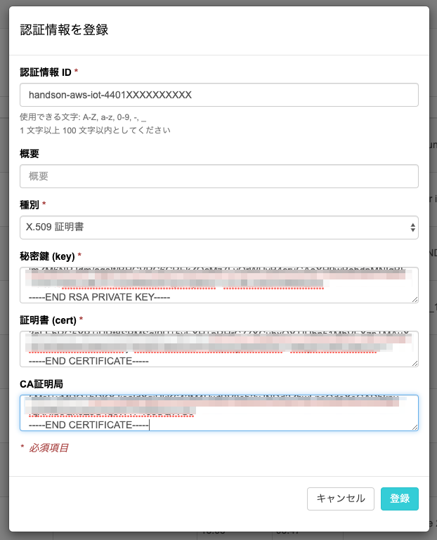
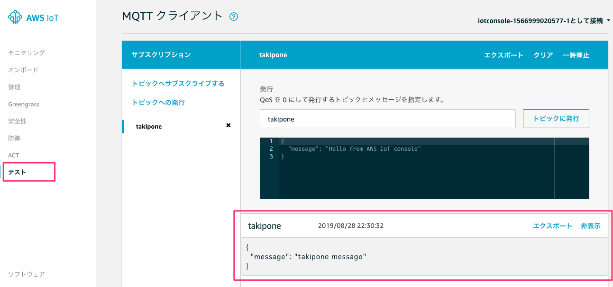

# SORACOM Beam Multi Credentials per group機能によるAWS IoT Core 証明書のプロビジョニング

# 事前準備

以下のソフトウェアを事前にインストールします。

- PC/Mac
  - AWS
    - Management Console(IAMユーザー)
    - AWS CLI
    - IAMポリシー `arn:aws:iam::aws:policy/AWSIoTFullAccess` をアタッチしたIAMユーザーを行使できること
  - SORACOM
    - SAMユーザー
    - soracom-cli
    - クレデンシャル作成とグループ設定変更の権限を持つSAMユーザーを行使できること
  - jq
- Raspberry Pi
  - mosquitto-clients
  - setup_air.shを実行しLTE接続できていること

## SAMパーミッション構文の例

```json
{
  "statements": [
    {
      "api": [
        "Credentials:create*",
        "Groups:*"
      ],
      "effect": "allow"
    }
  ]
}
```

# 1. AWS IoT Core 証明書の発行と SORACOM への登録

以下の手順でAWS IoTのx509証明書を発行し、SORACOMのクレデンシャルとして登録します。

## 1-1. AWS IoT Core証明書の発行

[AWS IoT コンソール](https://ap-northeast-1.console.aws.amazon.com/iot/home?region=ap-northeast-1#/home)を開き AWS IoT の設定を開始します。

まず 管理 > モノ > 作成 から、使用するデバイスをモノ(Thing)として作成します。



「単一のモノを作成する」をクリックし名前に「thing-<お名前>」と入力、他の項目は既定のまま「次へ」をクリックします。


モノに証明書を追加します。ここでは1-Click証明書作成の「証明書の作成」をクリックし証明書を作成します。


下記の３つの証明書をダウンロードのリンクよりダウンロードします(後ほど使用します)。
また、「有効化」をクリックして証明書を有効化します。
その後、「ポリシーをアタッチ」をクリックします。

- このモノの証明書 (ファイル名 : `<証明書ID>-certificate.pem.crt`)
- プライベートキー (ファイル名 : `<証明書ID>-private.pem.key`)
- AWS IoT のルート CA → [サーバー認証] - [Amazon Trust Services エンドポイント (推奨)] - [Amazon ルート CA 1](右クリックし、ファイルとして保存、ファイル名 : `AmazonRootCA1.pem`)

通常はここで [ポリシーのアタッチ] をクリックしモノにポリシーを割り当てますが、まだポリシーは未作成のため、ここではそのまま [完了] をクリックします。




次に 安全性 > ポリシー > ポリシーの作成からデバイスに割り当てるポリシーを作成します。


今回はどの MQTT topic にも Publish, Subscribe 可能なポリシーを作成します。
下記のように入力して [作成] をクリックします。

- 名前 : PubSubToAnyTopic
- アクション : iot:*
- リソースARN : *
- 効果 : 許可をチェック

次に作成したポリシーを作成したモノの証明書へ紐付けます。

安全性 > 証明書 を選択し、先ほど作成した証明書の右上の […] から [ポリシーのアタッチ] をクリックします。


先ほど作成した「PubSubToAnyTopic」を選択し、[アタッチ] をクリックします。



以上で AWS IoT Core へのモノの登録が完了しました。

## 1-2. SORACOMへのクレデンシャル登録

SORACOMユーザーコンソールに先ほど作成した証明書を登録します。

SIMのIMSIをクレデンシャル名に含めるため、SIM管理から自身のSIMを選択、[詳細]ボタンをクリックしIMSIをコピーします。



SORACOM ユーザーコンソールから、右上のオペレータメニューから「セキュリティ」を選択します。



メニューの「認証情報ストア」から「認証情報を登録」を選択します。



以下の内容を入力し、「登録」をクリックします。
ファイルのダウンロード時とは順番が異なることに注意します。

- 認証情報ID : `handson-aws-iot-<SIMのIMSI>`
- 概要 : 空欄のまま
- 種別 : 「X.509証明書」を選択
- 秘密鍵 (key) : `<証明書ID>-private.pem.key` ファイルの内容をペースト
- 証明書 (cert) : `<証明書ID>-certificate.pem.crt` ファイルの内容をペースト
- CA証明局 : `AmazonRootCA1.pem` ファイルの内容をペースト



これでクレデンシャルの構成は完了です。

## 2-1. SORACOM Beamの設定

**以下はSORACOMアカウントにつき、1回実行すれば良い設定です。**

SORACOMユーザーコンソールのメニューから[SIMグループ]をクリックします。
[+追加]ボタンからSIMグループ名 `beam` でSIMグループを作成します。グループ設定画面にあるグループIDをメモしておきます。

Beamに設定するAWS IoT CoreのエンドポイントをAWS IoT管理画面のメニュー [設定] にある「エンドポイント」をコピーします。

グループ設定にBeam MQTTを追加、クレデンシャル名にIMSIのプレースホルダを含めるように、以下の内容でグループ設定ファイル `group-config.json` をエディタで作成します。先ほど確認したAWS IoT Coreのエンドポイントを `destination` にセットします。

```json 
[
  {
    "key": "mqtt://beam.soracom.io:1883",
    "value": {
      "name": "AWS IoT",
      "destination": "mqtts://<AWS IoTのエンドポイント>:8883",
      "enabled": true,
      "addSubscriberHeader": false,
      "useClientCert": true,
      "clientCerts": {
        "default": {
          "$credentialsId": "handson-aws-iot-#{imsi}"
        }
      }
    }
  }
]
```

以下のコマンドでグループ設定を更新します。

```
soracom groups put-config --namespace SoracomBeam \
  --body @group-config.json \
  --profile <SORACOMプロファイル名> \
  --group-id <メモしたグループID>
```

## 2-2. SORACOM Beamの動作確認

SORACOM IoT SIMをセットしたデバイスからSORACOM BeamにMQTT接続し、AWS IoT Coreにアクセス出来る様子を確認します。

SORACOMユーザーコンソールのメニューから[SIM管理]をクリック、自分のSIMを選択して[操作] - [所属グループ変更]をクリック、2-1で作成したSIMグループ`beam`を選択し[グループ変更]をクリックします。

デバイスでMQTTクライアントである `mosquitto_pub` コマンドを実行し、SORACOM Beamに接続します。

```
mosquitto_pub -d -h beam.soracom.io -t <お名前> -m "test"
Client mosqpub|3518-raspberryp sending CONNECT
Client mosqpub|3518-raspberryp received CONNACK (0)
Client mosqpub|3518-raspberryp sending PUBLISH (d0, q0, r0, m1, '<お名前>', ... (4 bytes))
Client mosqpub|3518-raspberryp sending DISCONNECT
```

AWS IoT管理画面のメニューから「テスト」を選択、「トピックのサブスクリプション」に「<お名前>」トピックを入力し、「トピックへのサブスクライブ」をクリックしてサブスクライブを開始します。

何度か `mosquitto_pub` コマンドを再実行し、画面の右下にデバイスからパブリッシュしたメッセージが表示されることを確認します。



これで、SORACOM Beamによって適切なX.509証明書が付与されAWS IoT Coreで認証し、正常に動作することが確認できました。