# SORACOM KryptonによるAWS IoT Coreへの自動登録

本ハンズオンでは、SORACOM Kryptonの登録代行機能を利用して、AWS IoT CoreのThingおよびx509証明書の代行登録の様子を確認します。

# 事前準備

- PC/Mac
  - AWS
    - Management Console(IAMユーザー)
    - IAMユーザーを作成する権限を行使できること
  - SORACOM
    - SAMユーザー
    - soracom-cli
    - クレデンシャル作成とグループ設定変更の権限を持つSAMユーザーを行使できること
  - jq

以下のソフトウェアをRaspberry Piに事前にインストールします

- mosquitto-clients
- jq
- setup_air.shを実行しLTE接続できていること

## 証明書を生成する権限を持つ AWS IAM 資格情報を作成する

SORACOM Krypton が thing を作成し、証明書を生成してポリシーを適用するには、適切な権限セットを持つAWS資格情報のセットが必要です。 ここでは、AWS IAMユーザーを作成し、AWS資格情報を取得します。

AWS IAM コンソールを表示します。

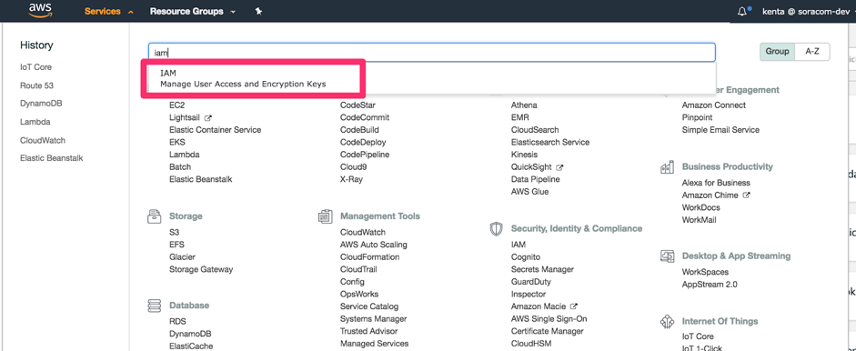

「ユーザー」メニューから「ユーザーを追加」をクリックします。

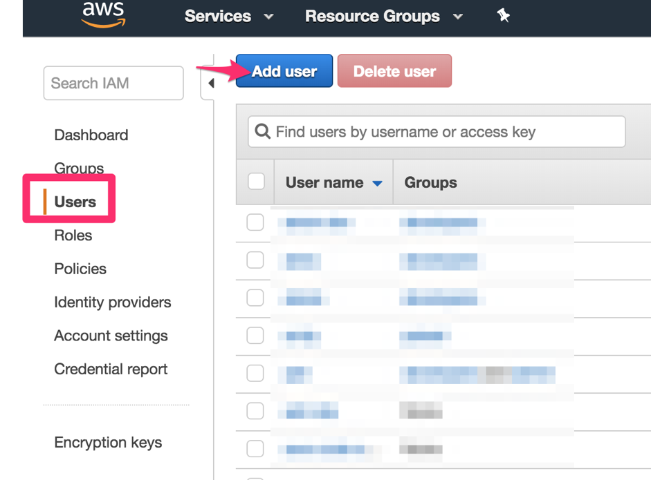

ユーザー名に `krypton-aws-iot-provisioner-<お名前>` と入力し、「プログラムによるアクセス」にチェックをつけ「次のステップ：アクセス権限」をクリックします。

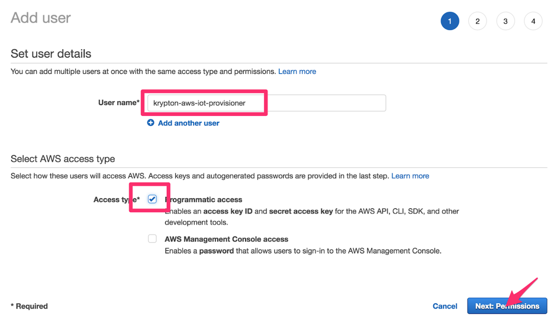

「既存のポリシーを直接アタッチ」を選択します。
「AWSIoTThingsRegistration」を検索してチェックします。

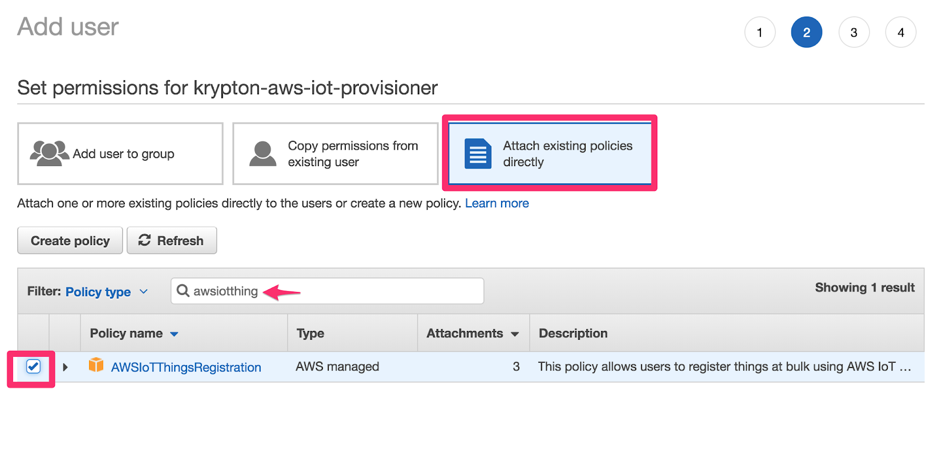

「ポリシーの作成」をクリックします。

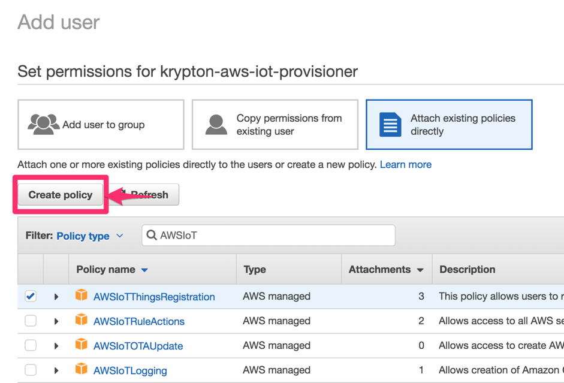


「IoT」を対象サービスとして選択し [CreateKeysAndCertificate] のチェックボックスを有効にし、 「Review Policy」をクリックします。

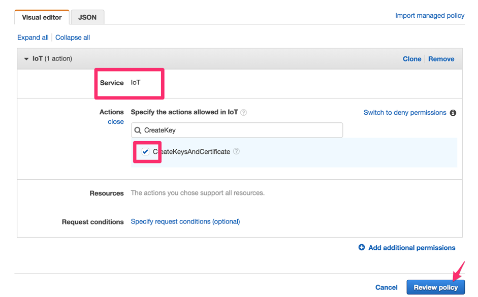

名前に `AWSIoTCreateKeysAndCertificate<お名前>` を入力して「Create policy」をクリックします。

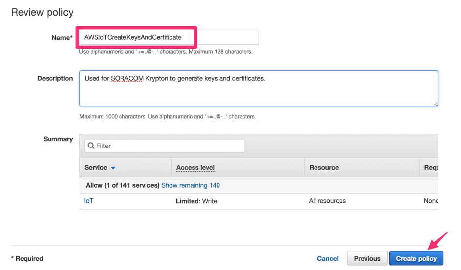

「ユーザーを追加」ウィザードに戻り、最後のステップで作成したポリシーを探します（更新ボタンをクリックする必要があります）。チェックボックスをクリックし、 「次のステップ：確認」をクリックします。


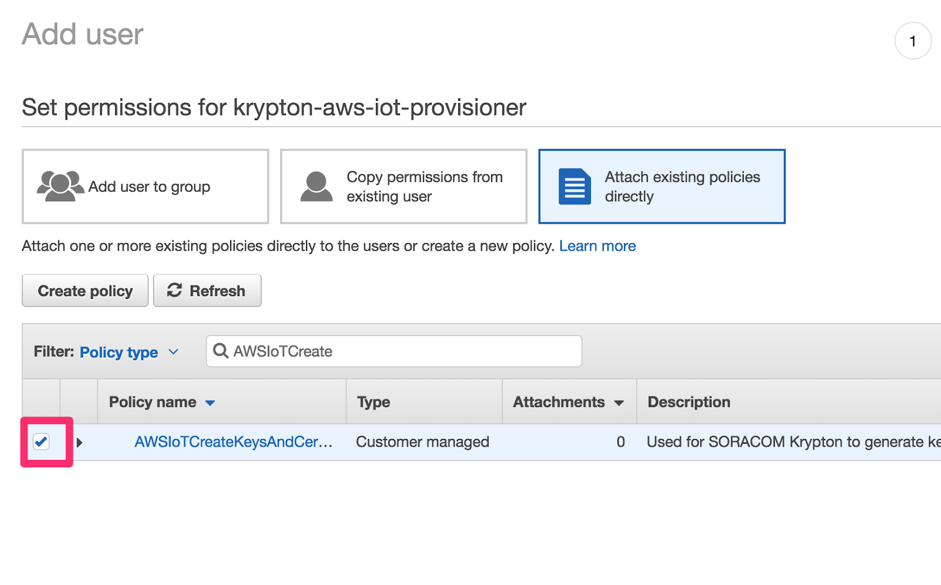

内容を確認し、「ユーザーの作成」をクリックします。

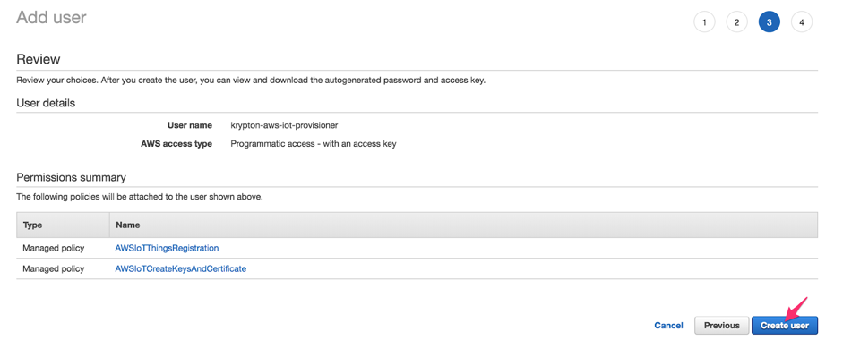

AWSアクセスキーIDとシークレットキーの両方をコピーして、保存します。（AWSシークレットアクセスキーはこの時点で一度だけ表示されます）
  
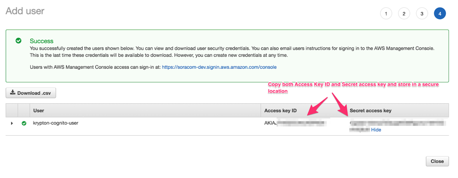

アクセスキーIDとシークレットキーを受講生にシェアしてください。
以上で事前準備は完了です。

## 1. SORACOM Krypton を設定する

SORACOM Krypton が AWS IoT Coreをプロビジョニングするために IoT SIM グループを設定します。 SORACOM 認証情報ストアにエントリを作成し、資格情報IDとAWS IoT関連のパラメータをグループコンフィグレーションで設定します。

### 1-1. SORACOM 認証情報ストアに AWS 資格情報を登録する

SORACOM ユーザーコンソール右上のオペレータメニューから「セキュリティ」を選択します。

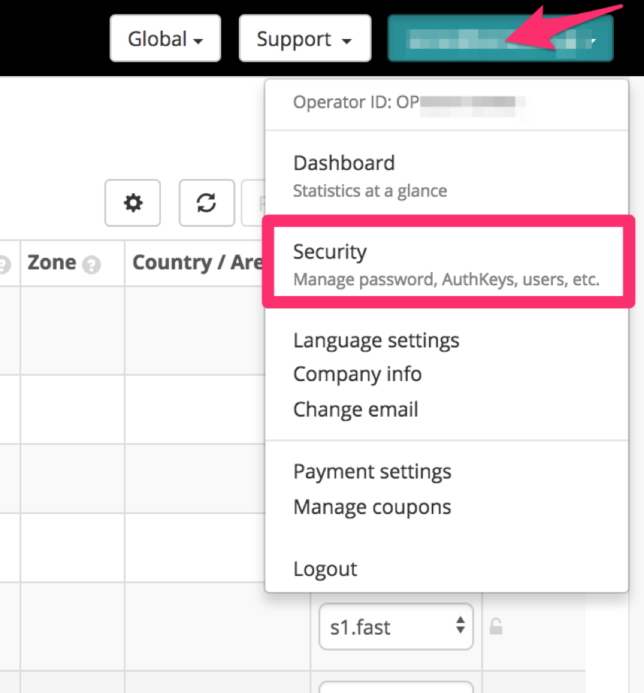

認証情報ストアから「認証情報を登録」を選択します。


認証情報セットに名前 `aws-<お名前>` を付け、タイプとして「AWS credentials」を選択します。事前にシェアされたAWS 認証情報を入力します。

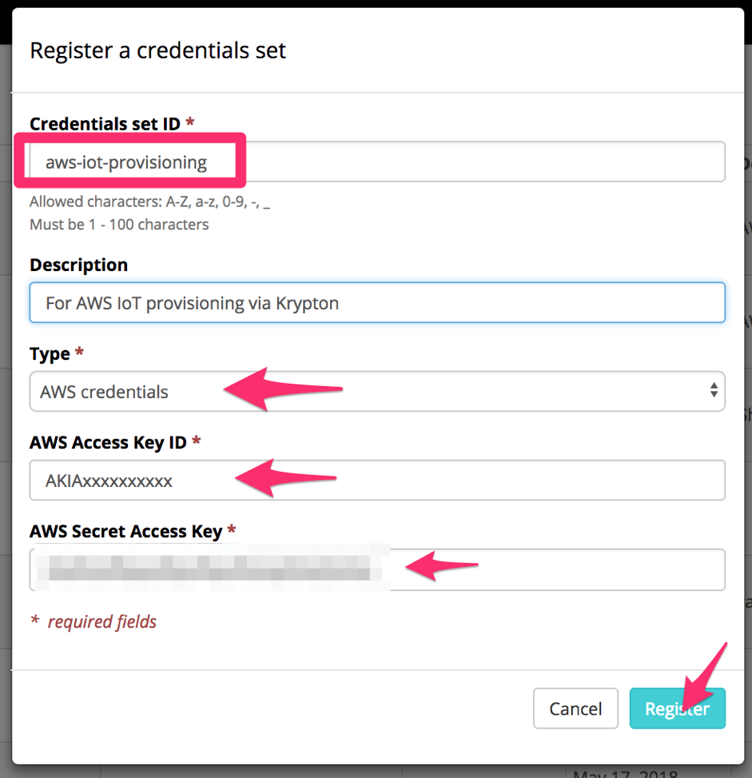


### 1-2. グループコンフィグレーションを作成し、SIM をグループに所属させます。

SORACOM ユーザーコンソールから SIM グループを表示します。

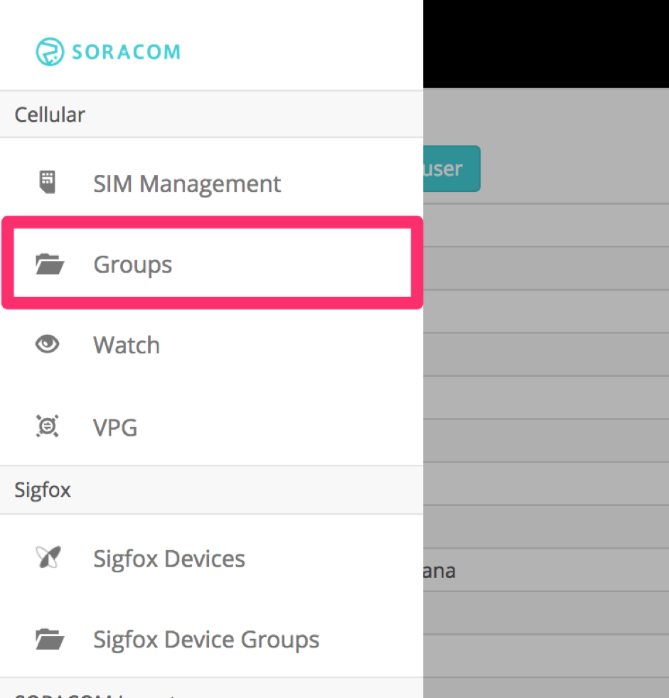

「追加」ボタンをクリックしてグループ名 `krypton-<お名前>` を作成します


グループをクリックし、グループ設定ビューに移動します。

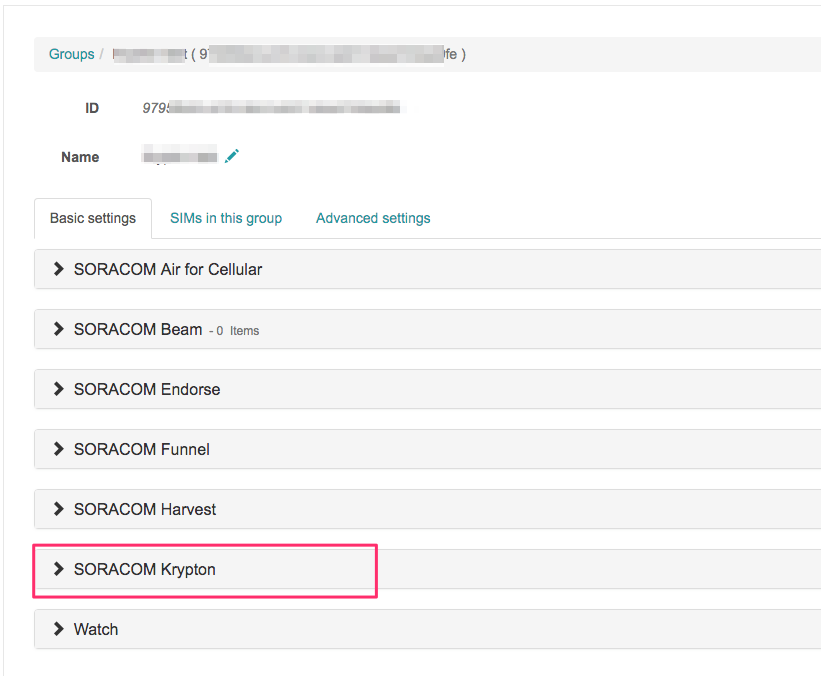

SIMグループの [SORACOM Krypton設定] を表示、スイッチをONにし [+] - [AWS IoT] を設定します。

手順1で設定した内容から、次のようにグループを設定します

- AWS リージョン: `ap-northeast-1`を入力
- 認証情報: 当ステップで作成した AWS IoT 用の認証情報を選択します
- Policy name: `PubSubToAnyTopic` と入力します
- Thing name pattern: `<お名前>-$imsi` と入力します。 `$imsi` はアクセス元の SIM の IMSI に置換されます
- ホスト名: Beamのハンズオンで設定した、AWS IoTのエンドポイント名を入力します
- ルート認証局証明書: 空のまま

[保存] をクリックして設定を保存します。

SORACOMユーザーコンソールの「SIM 管理」メニューに移動します。

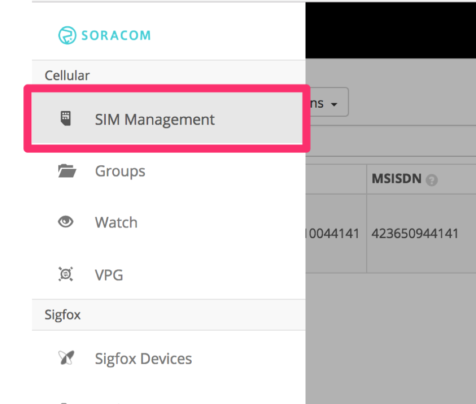

対象の SIM を選択し「アクション」メニューから「所属グループ変更」をクリックしてください。

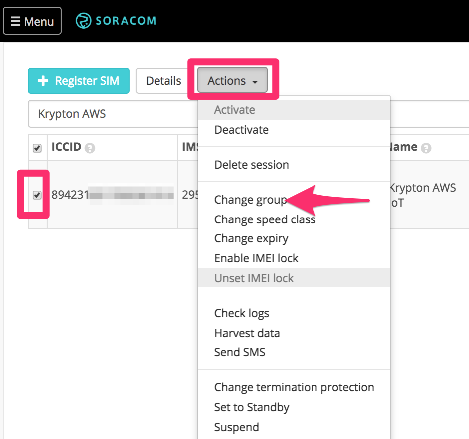

`krypton-<お名前>` グループを選択し、 「更新」をクリックしてください。

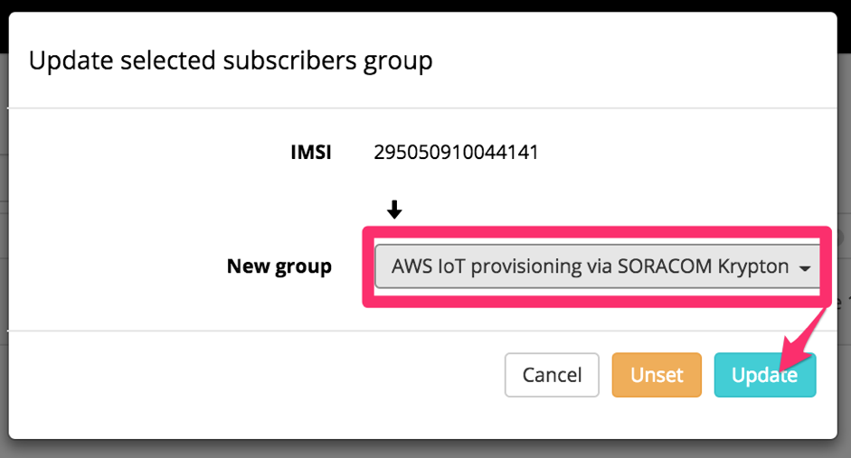

これでKryptonの設定は完了です。

# 2. Krypton を使用して Thing を作成し、デバイスを接続する

ここまでで、IoT SIM および Krypton を使用してデバイスをプロビジョニングする設定を行いました。次にデバイスを起動してKryptonのプロビジョニングAPIからx509証明書を受け取り、それを利用してAWS IoT Coreに接続します。

```bash
curl -X POST https://krypton.soracom.io:8036/v1/provisioning/aws/iot/bootstrap > cert.json
cat cert.json | jq .privateKey -r > thing-private-key.pem
cat cert.json | jq .certificate -r > cert.pem
ATS rootCAのダウンロード
wget https://www.amazontrust.com/repository/AmazonRootCA1.pem -O rootCA.pem
```

```
mosquitto_pub --cafile rootCA.pem --cert cert.pem --key thing-private-key.pem \
  -h <AWS IoTのエンドポイント名> -p 8883 -q 1 -d -t topic/test -i clientid2 -m "Hello, World"
Client clientid2 sending CONNECT
Client clientid2 received CONNACK (0)
Client clientid2 sending PUBLISH (d0, q1, r0, m1, 'topic/test', ... (12 bytes))
Client clientid2 received PUBACK (Mid: 1)
Client clientid2 sending DISCONNECT
```