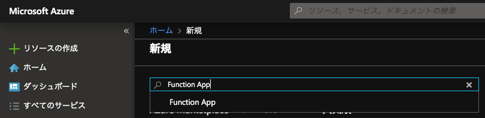
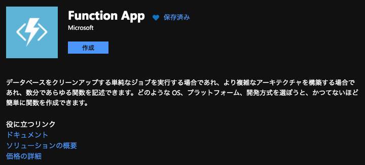
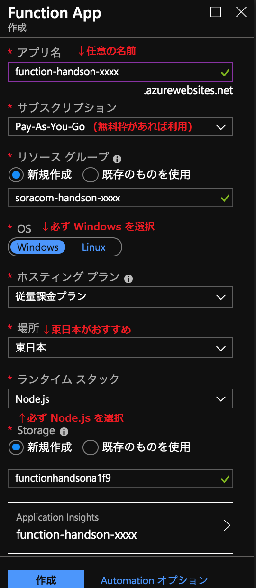
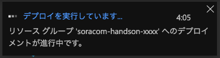
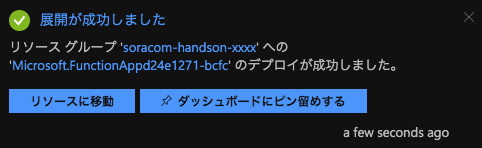
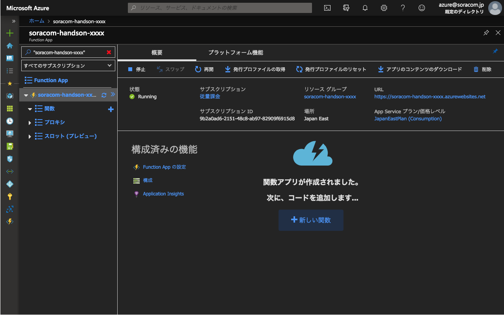
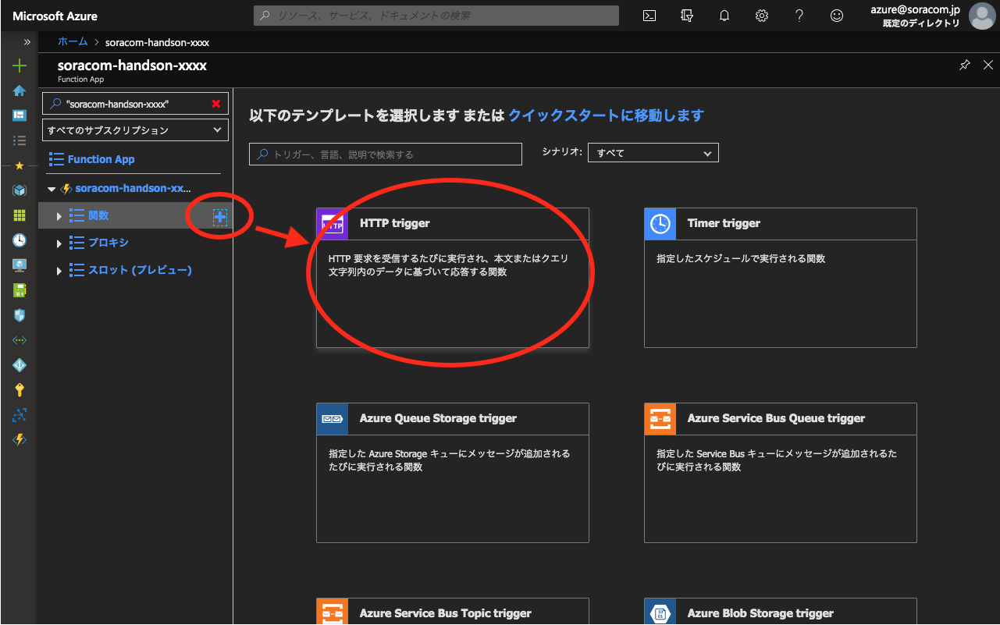
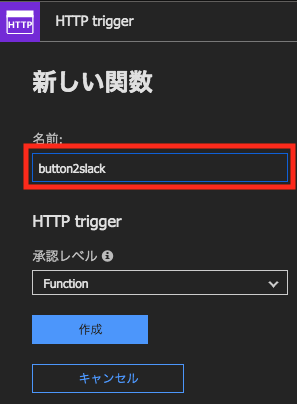
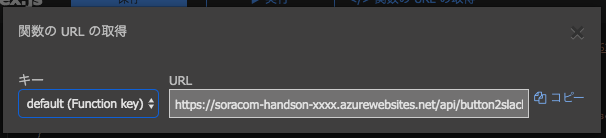

# B-1 Azure Functions で Slack 通知用 Function を作成
本ページでは、Azure Functions で Slack へ通知を行うための Function を作成します。

## Azure Portal へのサインイン
[https://portal.azure.com](https://portal.azure.com){:target="_blank"} にアクセスし、Azure Portal へログインします。
> まだアカウントを作成していない場合には、 [こちらのリンク](https://docs.microsoft.com/ja-jp/learn/modules/create-an-azure-account/5-exercise-create-an-azure-account){:target="_blank"} を参考にして、アカウントを作成してください

## Function App を作成する
Azure Portal 左上にある 「＋リソースの作成」ボタンを押して検索窓に `Function App` と入力し、作成ボタンを押します

下記のようにパラメータを入力し、作成を押すとデプロイが始まります

デプロイが完了すると、下記のように表示されるので、リソースに移動します
> ダイアログが閉じてしまった場合は、上部のお知らせアイコンからたどれます

## 関数を作成する
「関数」の右にある「＋」マークをクリックし、「HTTP trigger」をクリックします。

関数の名前を変更し（ `button2slack` など）、作成を押すとしばらくして関数の作成が完了し、プログラムコードの編集画面となります。

下記のプログラムコードをコピーして貼り付け、１行目に webhook_url を設定し、保存します

最後に、「</> 関数の URL の取得」をクリックし、「コピー」をクリックして、URL をどこかにメモしておきます。

## 以上で本ページの作業は完了となります