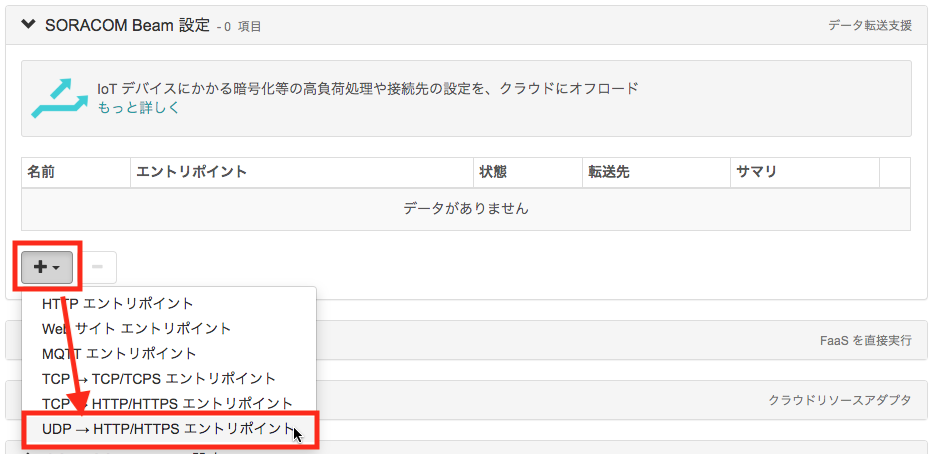
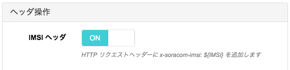
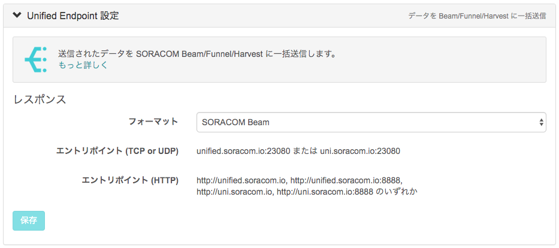
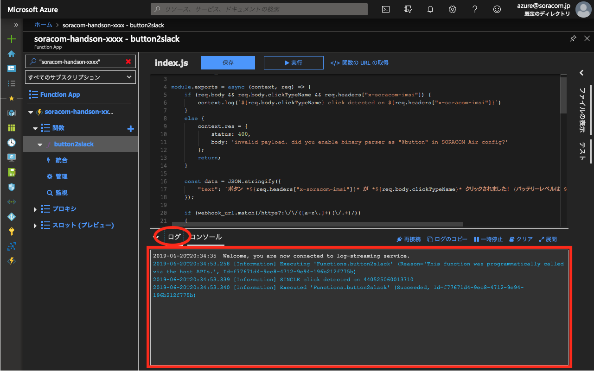
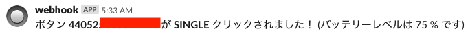

# B-2 SORACOM Beam から Function App を呼び出す

本ページでは、ボタンを押した時に先ほど作成した Function を呼び出すために、SORACOM Beam の設定を行います。
B-1 の最後にメモしておいた URL を使いますので、もしメモしていなかった場合は Azure Portal で確認してください。

## SORACOM Beam とは

IoT デバイスにかかる暗号化等の高負荷処理や接続先の設定を、クラウドにオフロードできるサービスです。  
SORACOM LTE-M Button for Enterprise はデバイス実装のシンプル・低価格化を実現するため、ボタンデバイスのデータ送信先は SORACOM Beam に固定されてます。実際の連携先クラウドの情報は SORACOM Beam 内で設定することで、クラウドの進化に対してデバイスの設定を変えることなく追従することができます。また、セキュア通信についても LTE-M の通信レベルでの暗号化と SORACOM Beam による暗号化変換による組み合わせでトータルで実現しています。

詳細は [SORACOM Beam サービス紹介ページ](https://soracom.jp/services/beam/) をご覧ください。

## グループの設定
作業A で作成したグループを使用します。

SIM 管理画面でボタンの SIM のグループ名をクリックし、グループ詳細画面を開きます。
> または、SORACOM ユーザコンソール 左上の「≡ Menu」から `SORACOM Air for Cellular` ＞ `SIM グループ` を開き、ボタンに割り当てているグループ詳細画面を開きます。

### SORACOM Beam 設定
「SORACOM Beam 設定」を開き、「＋」をクリックして、「UDP → HTTP/HTTPS エントリポイント」を選びます。

転送先を下記のように設定します。

プロトコル： HTTPS
ホスト名： URL の `oooo.azurewebsites.net` 部分 (`soracom-handson-xxxx.azurewebsites.net`)
ポート番号： 空 (もしくは 443)
パス： `/api/button2slack` から後ろの部分すべて

ヘッダ操作は、IMSI ヘッダのみを ON とします。

最後に、一番下の「保存」を押します。

### Unified Endpoint 設定
レスポンスのフォーマットで「Beam」を選び、「保存」を押します。

## ボタンを押して Function App を呼び出す

ボタンを押して LED が緑色に光れば、呼び出し成功です。

Azure Portal の Function App のログを確認してみましょう。

## Slack の画面を確認する
Slack にクリックイベントが表示されるので、確認します。

## 以上で本ページの作業は完了となります

## トラブルシュート

* ボタン押下の結果、LED が赤になってしまう
    * A: 15秒以上経ってから LED が赤になる場合は、電波状況が悪い場合があるため再度試してみてください
    * B: 10秒程度で LED が赤になる場合は Function Apps の見直しが必要な場合があります
        * Function Apps のコードで `webhook_url` の `運営から入手` の書き換えを見直してください
