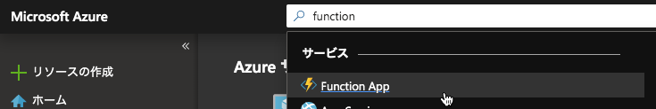
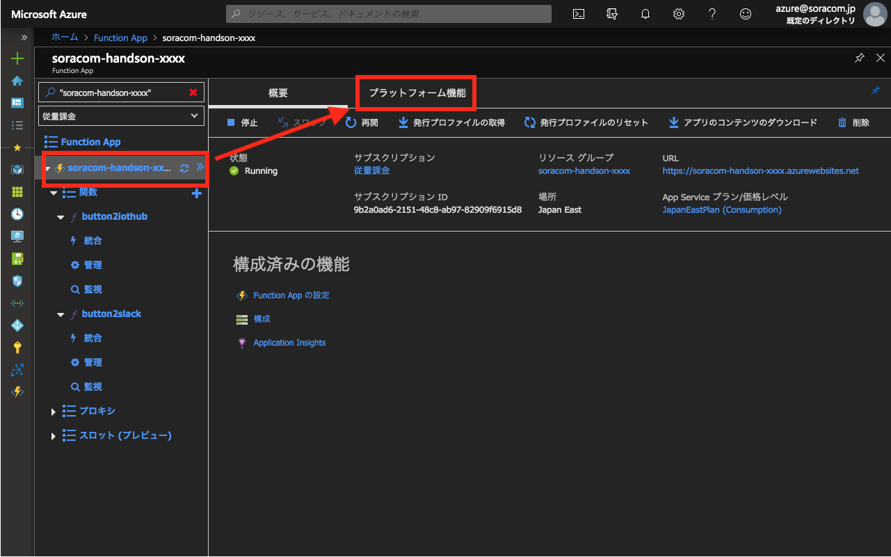
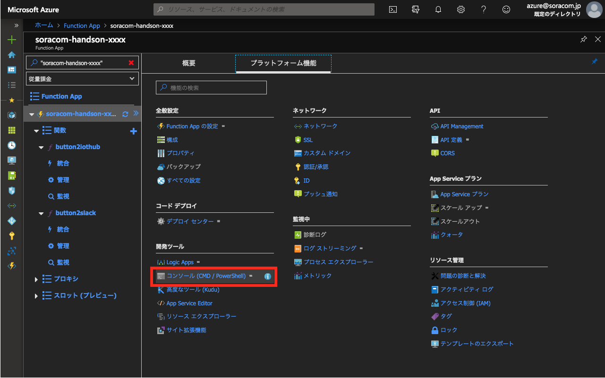
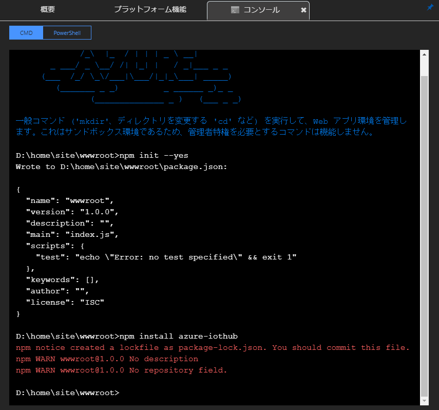
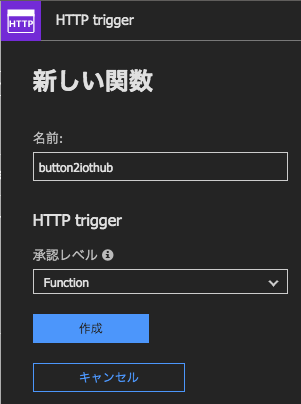
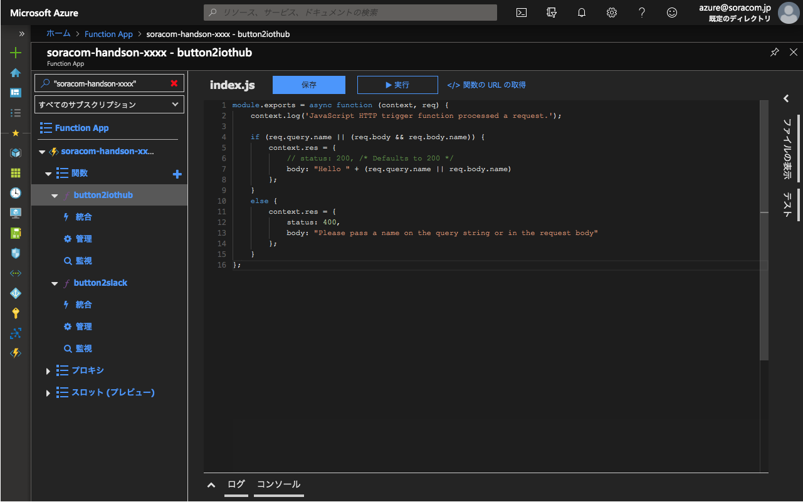
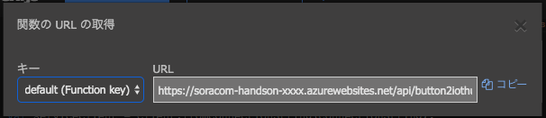

# C-1 Azure Functions で デバイス制御用 Function を作成
本ページでは、Azure Functions から Azure IoT Hub へ API 連携を行うための Function を作成します。

## Azure Portal で B-1 で作成済みの Function App を開く
もし閉じてしまっている場合には [https://portal.azure.com](https://portal.azure.com){:target="_blank"} にアクセスし、検索窓に function と入力し、 Function App を開きます。



## Azure IoT Hub ライブラリをインストールする
プログラムの実行に必要なライブラリをインストールします。

Function App を開いた状態で、上部の「プラットフォーム機能」をクリックします。



コンソールを開きます。



以下のコマンド 2 つを 1 行ずつ入力します

```
npm init --yes
npm install azure-iothub
```



しばらくするとコマンドが完了します。

> WARNING が出ますが、特に問題ありません。

## 関数を作成する
「関数」の右にある「＋」マークをクリックし、「HTTP trigger」をクリックします。


関数の名前を変更し（ `button2iothub` など）、作成を押すとしばらくして関数の作成が完了し、プログラムコードの編集画面となります。




下記のプログラムコードをコピーして貼り付け、１〜２行目を設定し、保存します

<script src="https://gist.github.com/j3tm0t0/a81b780297b8c692bee893067360b6bb.js"></script>

最後に、「</> 関数の URL の取得」をクリックし、「コピー」をクリックして、URL をどこかにメモしておきます。



## 以上で本ページの作業は完了となります