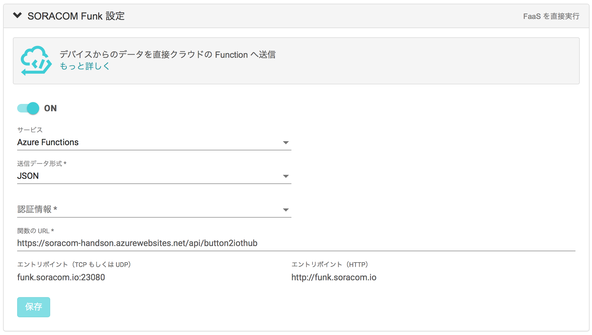
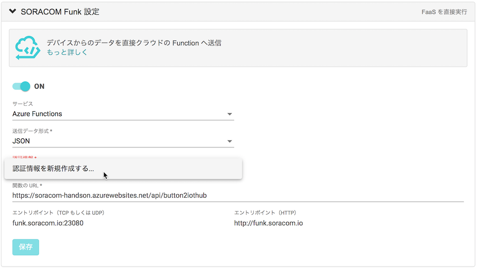
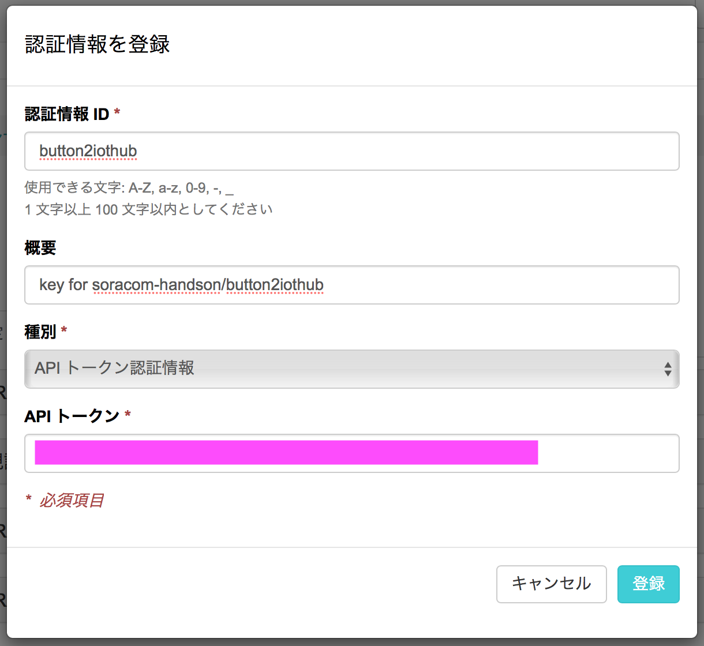
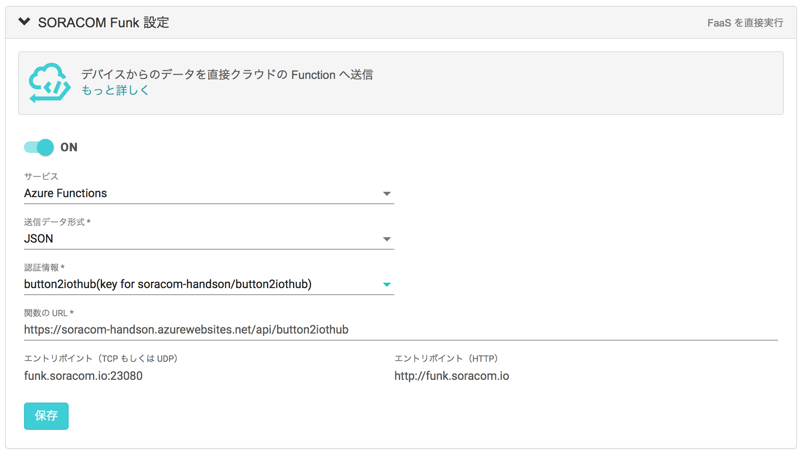

# C-2 SORACOM Funk から Function App を呼び出し、デバイスを制御する

本ページでは、ボタンを押した時に先ほど作成した Function を呼び出すために、SORACOM Funk の設定を行います。
C-1 の最後にメモしておいた URL を使いますので、もしメモしていなかった場合は Azure Portal で確認してください。

## SORACOM Funk とは

SORACOM Funk(以下、Funk) は、クラウドサービスの Function を直接実行できるサービスです。クラウドリソースを活用することでデバイス側の実装をシンプルに保ち、処理をオフロードや低電力消費化が可能となります。
本賞では、SORACOM Funk の連携先として Function App を設定してみましょう。

詳細は [SORACOM Funk サービス紹介ページ](https://soracom.jp/services/funk/) をご覧ください。

## グループの設定
作業A で作成したグループを使用します。

SIM 管理画面でボタンの SIM のグループ名をクリックし、グループ詳細画面を開きます。
> または、SORACOM ユーザコンソール 左上の「≡ Menu」から `SORACOM Air for Cellular` ＞ `SIM グループ` を開き、ボタンに割り当てているグループ詳細画面を開きます。

### SORACOM Funk 設定
「SORACOM Funk 設定」を開き、下記のように設定します。

- サービス: Azure Functions
- 送信データ形式: JSON
- 関数のURL: C-1 でメモした URL の、`?code=...` より前の部分

認証情報の欄をクリックして「認証情報を新規作成する...」を選択する。

以下のように認証情報を登録します

- 認証情報ID: (任意の文字列)
- 概要: (何の認証情報か分かるようなメモ)
- API トークン: URL のうち `?code=` より後ろの文字列 (`?code=` は含まない)

「保存」を押して、Funk 設定を完了します。

最後にグループ設定の一番下部にある「Unified Endpoint 設定」を開き、フォーマットから 「SORACOM Funk」を洗濯して、「保存」を押します。

## ボタンを押して Function App を呼び出し、デバイスが連動したかどうか確認する

ボタンを押して LED が緑色に光れば、呼び出し成功です。

デバイスが応答したかどうかを確認しましょう。

> シングルクリックで２秒間、ダブルクリックで４秒間、ロングクリックで５秒間、ファンが回ります。

また、Azure Portal の Function App のログを確認してみましょう。

## 以上で本ページの作業は完了となります

## トラブルシュート

* ボタン押下の結果、LED が赤になってしまう
    * A: 15秒以上経ってから LED が赤になる場合は、電波状況が悪い場合があるため再度試してみてください
    * B: 10秒程度で LED が赤になる場合は Function Apps の見直しが必要な場合があります
        * Function Apps のコードで `connectionString / targetDevice` の `運営から入手` の書き換えを見直してください