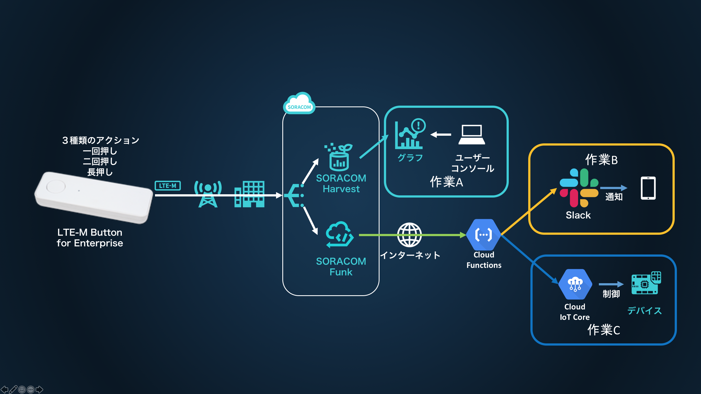

# SORACOM LTE-M Button と Google Cloud Platform で簡単IoTを実現

SORACOM LTE-M Button for Enterprise (以下 SORACOM LTE-M Button) を使った自習形式ハンズオンです。  
作業時間の目安は作業Ａで 30分～45分、作業Ｂのそれぞれの作業で15分～30分となります。

<h2 id="prepare">必要なもの</h2>

* パソコン / 1 台
    * タブレットは不可
    * Wi-Fi でインターネットに接続できる環境
    * ブラウザ
        * Google Chrome 最新版をお使いください。それ以外はサポート致しかねます
        * OS は不問ですが、できる限り最新の OS の利用を強く推奨します
        * プロキシー設定やアクセス制限などの社内システム設定がある場合は受講できない場合があります
* SORACOM LTE-M Button for Enterprise / 1 個
    * 会場によっては貸出いたします。また、すでにお持ちの場合は持ち込み可です
    * SORACOM LTE-M Button Plus でもお使いいただけます
* 有効なクレジットカード / 1 つ
    * SORACOM アカウント、および Google アカウントを作成いただくのに必要となります
* 会場で確認可能なメールアドレス / 1 つ
    * SORACOM アカウント作成時を行う際に必要となります（すでに SORACOM アカウントをお持ちの方、もしくは、貸出の方は不要です）
* Google アカウント
    * [Google Cloud](https://cloud.google.com){:target="_blank"} を開き、右上の「無料トライアル」からアカウントを作成ください

<h2 id="standby">作業前の準備</h2>

* Wi-Fi に接続してください (接続情報は別途お知らせします)
* 「進ちょく表」を開いてください (URL は別途お知らせします。完全に自習の場合は不要です)

<h2 id="overview">全体像</h2>

- 作業A: ボタンのクリックイベントを SORACOM Harvest を使って可視化
- 作業B: ボタンのクリックイベントを Slack に送信します
- 作業C: ボタンのクリックイベントをきっかけに、Cloud IoT Core で接続されたデバイスを制御します

必要な作業は以下の通りとなります。

<h2 id="workflow">進め方</h2>
作業A → 作業B → 作業C の順番で実施してください

<h2 id="work-a">作業A: Harvest を使ったボタンの動作確認</h2>

1. [SORACOM ユーザコンソール](https://console.soracom.io){:target="_blank"} で SORACOM LTE-M Button for Enterprise を 受け取る
    - **貸し出されたボタンを利用する場合には必要ありません**
2. [ボタンのクリックイベントを SORACOM Harvest で確認する](../common/harvest){:target="_blank"}

<h2 id="work-b">作業B: Slack を使ったクリックイベント通知</h2>

1. [ Cloud Functions で Slack 通知用 Function を作成 ](work-b/gcp){:target="_blank"}
2. [ SORACOM Funk から Functions を呼び出す ](work-b/soracom){:target="_blank"}

<h2 id="work-c">作業C: ボタンと Cloud IoT Core を連携させてデバイス制御</h2>

1. [ Cloud Functions で デバイス制御用 Function を作成 ](work-c/gcp){:target="_blank"}
2. [ SORACOM Funk から Functions を呼び出し、デバイスを制御する ](work-c/soracom){:target="_blank"}

<h2 id="closing">作業: あとかたづけ</h2>

<h3 id="cleanup-gcp">GCP リソース</h3>
* プロジェクトのシャットダウン
    * ダッシュボードの左上から、プロジェクト設定に移動し上部メニューから「シャットダウン」をクリック
    * プロジェクト ID をタイプして「シャットダウン」をクリック

<h3 id="cleanup-soracom">SORACOM リソース</h3>

* 本ハンズオンで利用した SIM グループの削除
    * SORACOM LTE-M Button for Enterprise をグループから解除してください
    * グループ解除後、SIM グループの削除をしてください (SIM グループ設定の "高度な設定" から削除ができます)
* SORACOM Harvest のデータ削除
    * データを表示した後、対象データのチェックボックスを付けて [削除] をします

<h3 id="fee">料金について</h3>

#### GCP 各種サービスの利用料金の目安
本テキストの内容であれば、よほどの事がない限り(月間200万回以上クリックするなど)、無料枠の範囲内でご利用いただけます
詳細については [Cloud Functions の料金](https://cloud.google.com/functions/pricing){:target="_blank"} をご参照ください

#### SORACOM LTE-M Button for Enterprise

販売価格 5980 円 に加えてご利用にあたっては plan-KM1 の基本料金(月額100円)、データ通信量に応じたデータ通信料(*)が発生します。  
plan-KM1の料金は[ご利用料金 - 日本向け Air SIM](https://soracom.jp/services/air/cellular/price/#plan-km1){:target="_blank"} をご確認ください。  
SORACOM Harvest 、 SORACOM Beam 、SORACOM Funk 等、 SORACOM サービス利用の費用は別途かかります。

(*) 目安として、１クリックあたり約 0.25 円程度

#### SORACOM サービスの利用料金の目安

* [SORACOM Harvest 料金](https://soracom.jp/services/harvest/price/){:target="_blank"}
    * Harvest を有効にしたグループに所属する 1 SIM カードまたは 1 デバイスあたり 1 日 5 円 (2000リクエスト/日/SIM あたりのリクエスト含む)
    * 1 アカウントあたり毎月 31 日分の (もしくは 2000リクエスト/日以内)の無料枠があります

* [SORACOM Funk 料金](https://soracom.jp/services/funk/price/){:target="_blank"}
    * SORACOM Funk へのリクエスト毎に 0.0018 円/リクエスト
        * Funk から転送先クラウドサービスへのリクエスト毎に 1 リクエストとカウントします。
    * 1 アカウントあたり 50,000リクエスト/月の無料枠があります

※ 料金は全て送料や税抜きです。

<!--

### 資料集

<h2 id="appendix">おまけコンテンツ</h2>

-->
