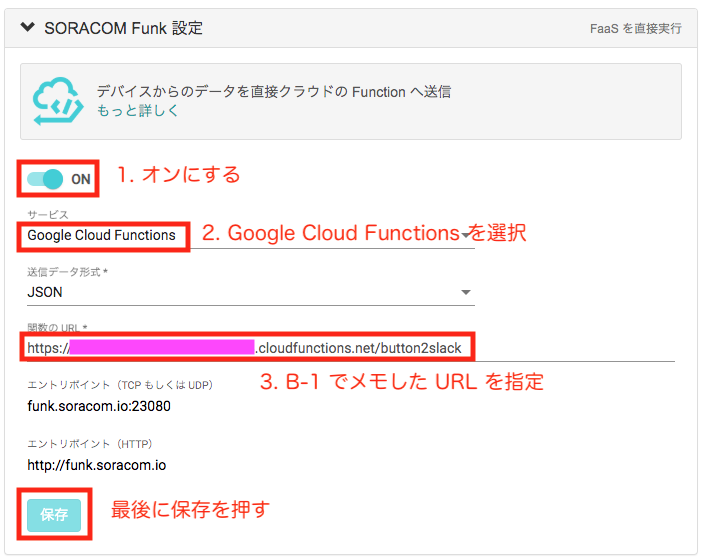
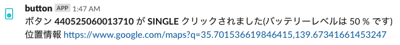

# B-2 SORACOM Funk から 関数(Function) を呼び出し、通知を行う

本ページでは、ボタンを押した時に先ほど作成した 関数(Function) を呼び出すために、SORACOM Funk の設定を行います。
B-1 の最後にメモしておいた URL を使いますので、もしメモしていなかった場合は GCP コンソール で確認してください。

## SORACOM Funk とは

SORACOM Funk(以下、Funk) は、クラウドサービスの Function を直接実行できるサービスです。クラウドリソースを活用することでデバイス側の実装をシンプルに保ち、処理をオフロードや低電力消費化が可能となります。
本章では、SORACOM Funk の連携先として 先ほど作成した Function を設定してみましょう。

詳細は [SORACOM Funk サービス紹介ページ](https://soracom.jp/services/funk/) をご覧ください。

## グループの設定
作業A で作成したグループを使用します。

SIM 管理画面でボタンの SIM のグループ名をクリックし、グループ詳細画面を開きます。
> または、SORACOM ユーザコンソール 左上の「≡ Menu」から `SORACOM Air for Cellular` ＞ `SIM グループ` を開き、ボタンに割り当てているグループ詳細画面を開きます。

### SORACOM Funk 設定
「SORACOM Funk 設定」を開き、下記のように設定します。

- サービス: Google Cloud Functions
- 送信データ形式: JSON
- 関数のURL: B-1 でメモした URL

## ボタンを押して 関数(Function) を呼び出す

ボタンを押して LED が緑色に光れば、呼び出し成功です。

## Slack の画面を確認する
Slack にクリックイベントが表示されるので、確認します。

## 以上で本ページの作業は完了となります

## トラブルシュート

* ボタン押下の結果、LED が赤になってしまう
    * A: 15秒以上経ってから LED が赤になる場合は、電波状況が悪い場合があるため再度試してみてください
    * B: 10秒程度で LED が赤になる場合は Function 設定の見直しが必要な場合があります
        * URL は正しく指定出来ているか
        * Function のコードが正しくコピー出来ているか
        * package.json で追加パッケージが指定されているか
        * 実行関数を `main` に書き換えたか
        * Function のページで「ログを表示」をクリックし、メッセージを確認