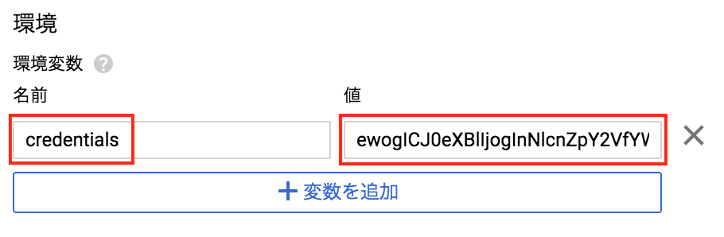
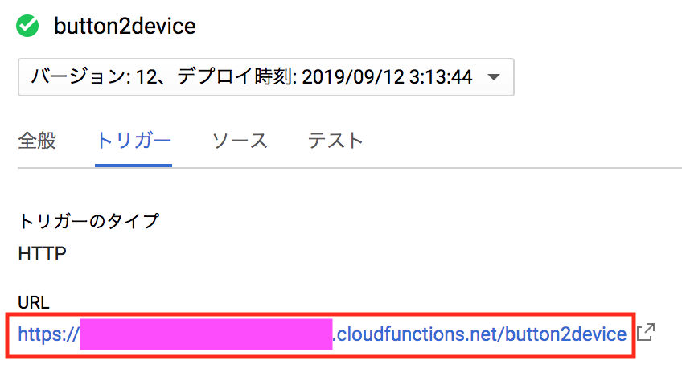

# C-1 Cloud Functions で デバイス制御用 関数(Function) を作成
本ページでは、Cloud Functions から Cloud IoT Core へ API 連携を行うための 関数(Function) を作成します。

## GCP Console を開く
もし閉じてしまっている場合には [https://console.cloud.google.com](https://console.cloud.google.com){:target="_blank"} にアクセスし、コンソールへログインします。
コンソール左上の「≡」をクリックしてメニューを開き、Cloud Functions を選びます。


B-1 で作成した関数の画面が開いていた場合は、コンソール左上の「｛…｝Cloud Functions」 をクリックし、関数の一覧画面に戻ります。

## 新規関数の作成
上部メニューの「＋関数を作成」をクリックします。

以下のパラメータを変更し「作成」をクリックします。

- 名前: "button2device" など、処理内容がわかりやすいもの

リストの関数名をクリックします。しばらく待つと、関数名の前に ✅ マークが表示され、最初のデプロイが完了した事がわかります。

## 関数の編集
上部メニューから「編集」をクリックし、編集モードに入ります。

４つの作業が必要になります。 **必ず、すべて漏れのないように行ってください。**

### 1. プログラムコードの変更
下記のプログラムコードをコピーして index.js に貼り付けます。

<script src="https://gist.github.com/j3tm0t0/1501e4a451df25ad5b557b6423b8c9fc.js"></script>

### 2. package.json の編集
「package.json」 をクリックし、以下の内容をコピーして、貼り付けます

```
{
  "name": "button-handson-device",
  "version": "1.0.0",
  "dependencies": {
    "jsonwebtoken": "^8.5.1",
    "request": "^2.88.0",
    "@google-cloud/iot": "^1.0.0"
  }
}
```

### 3. 実行する関数の変更
ソースコード下部の「実行する関数」を、`main` に変更します。

### 4. 環境変数の設定
「環境変数、ネットワーキング、タイムアウトなど」をクリックし、「環境変数」の欄に以下を設定します。

- 名前: `credentials`
- 値: (運営から入手)



最後にデプロイを押します。

## 関数トリガー URL の確認
「トリガー」をクリックし「URL」をメモ帳などにコピーしておきます。



## 以上で本ページの作業は完了となります