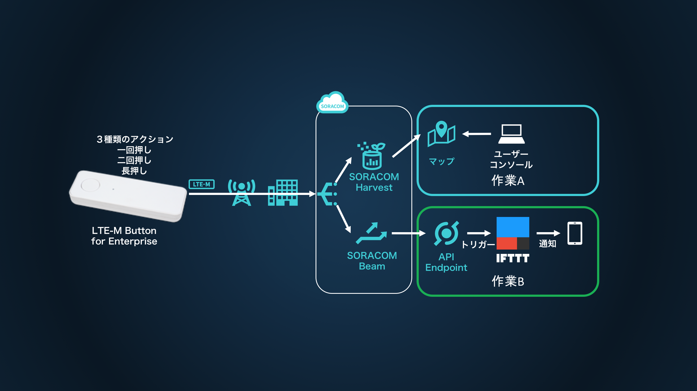

# SORACOM LTE-M Button と IFTTT で簡単IoTを実現

SORACOM LTE-M Button for Enterprise (以下 SORACOM LTE-M Button) を使った自習形式ハンズオンです。  
作業時間の目安は作業Ａで 10分、作業Ｂで20分となります。

<h2 id="prepare">必要なもの</h2>

* パソコン / 1 台
    * タブレットは不可
    * Wi-Fi でインターネットに接続できる環境
    * ブラウザ
        * Google Chrome 最新版をお使いください。それ以外はサポート致しかねます
        * OS は不問ですが、できる限り最新の OS の利用を強く推奨します
        * プロキシー設定やアクセス制限などの社内システム設定がある場合は受講できない場合があります
* SORACOM LTE-M Button for Enterprise / 1 個
    * 会場によっては貸出いたします。また、すでにお持ちの場合は持ち込み可です
    * SORACOM LTE-M Button Plus でもお使いいただけます
* 有効なクレジットカード / 1 つ
    * SORACOM アカウントを作成いただくのに必要となります（すでに SORACOM アカウントをお持ちの方、もしくは、貸出の方は不要です）
* 会場で確認可能なメールアドレス / 1 つ
    * SORACOM アカウント作成時を行う際に必要となります（すでに SORACOM アカウントをお持ちの方、もしくは、貸出の方は不要です）
* IFTTT アカウント
    * [IFTTT Sign up](https://ifttt.com/join){:target="_blank"} からアカウントを作成できます
        * Google アカウント または Facebook アカウントでのログインが簡単ですが、メールアドレスとパスワードを使った認証も可能です
* LINE アカウント
    * メールアドレス認証が必要となります
    * LINE をご利用でない方は、Twitter Facebook や Gmail など別のサービスを使用してください
* 運営から入手する情報
    * [認証情報](https://handson.soracom.io/button/ifttt){:target="_blank"}

<h2 id="standby">作業前の準備</h2>

* Wi-Fi に接続してください (接続情報は別途お知らせします)
* 「進ちょく表」を開いてください (URL は別途お知らせします。完全に自習の場合は不要です)

<h2 id="overview">全体像</h2>

- 作業A: ボタンのクリックイベントを SORACOM Harvest を使って可視化
- 作業B: ボタンのクリックイベントを IFTTT を経由して通知します

必要な作業は以下の通りとなります。

<h2 id="workflow">進め方</h2>
作業A → 作業B の順番で実施してください

<h2 id="work-a">作業A: Harvest を使ったボタンの動作確認</h2>

1. [SORACOM ユーザコンソール](https://console.soracom.io){:target="_blank"} で SORACOM LTE-M Button for Enterprise を 受け取る
    - **貸し出されたボタンを利用する場合には必要ありません**
2. [ボタンのクリックイベントを SORACOM Harvest で確認する](../common/harvest){:target="_blank"}

<h2 id="work-b">作業B: IFTTT を使ったクリックイベント通知</h2>

1. [ IFTTT で Applet を作成する ](work-b/ifttt){:target="_blank"}
2. [ SORACOM Beam から IFTTT を呼び出す ](work-b/soracom){:target="_blank"}

<h2 id="closing">作業: あとかたづけ</h2>

<h3 id="cleanup-ifttt">IFTTT リソース</h3>
無料サービスですので特に課金などは発生しませんが、Applet を削除したり、各サービスとのリンクを切っておくと不用意に通知される事はありません。

<h3 id="cleanup-soracom">SORACOM リソース</h3>

* 本ハンズオンで利用した SIM グループの削除
    * SORACOM LTE-M Button for Enterprise をグループから解除してください
    * グループ解除後、SIM グループの削除をしてください (SIM グループ設定の "高度な設定" から削除ができます)
* SORACOM Harvest のデータ削除
    * データを表示した後、対象データのチェックボックスを付けて [削除] をします

<h3 id="fee">料金について</h3>

#### SORACOM LTE-M Button for Enterprise

販売価格 5980 円 に加えてご利用にあたっては plan-KM1 の基本料金(月額100円)、データ通信量に応じたデータ通信料(*)が発生します。  
plan-KM1の料金は[ご利用料金 - 日本向け Air SIM](https://soracom.jp/services/air/cellular/price/#plan-km1){:target="_blank"} をご確認ください。  
SORACOM Harvest 、 SORACOM Beam 、SORACOM Funk 等、 SORACOM サービス利用の費用は別途かかります。

(*) 目安として、１クリックあたり約 0.25 円程度

#### SORACOM サービスの利用料金の目安

* [SORACOM Harvest 料金](https://soracom.jp/services/harvest/price/){:target="_blank"}
    * Harvest を有効にしたグループに所属する 1 SIM カードまたは 1 デバイスあたり 1 日 5 円 (2000リクエスト/日/SIM あたりのリクエスト含む)
    * 1 アカウントあたり毎月 31 日分の (もしくは 2000リクエスト/日以内)の無料枠があります
* [SORACOM Beam 料金](https://soracom.jp/services/beam/price/){:target="_blank"}
    * SORACOM Beam への IN/OUT それぞれに 0.0009 円/リクエスト
        * 例) UDP → HTTPS をおこなった場合: SORACOM Beam への UDP/IN で 0.0009 円、HTTPS/OUT で 0.0009 円の計 0.0018 円がかかります
    * 1 アカウントあたり 100,000リクエスト/月の無料枠があります
* [簡易位置測位機能](https://dev.soracom.io/jp/docs/location_service/){:target="_blank"}
    * 1SIM/1ボタンあたり : 月額 50円（月間750リクエスト含む）
    * 750回を越したリクエストについては リクエストあたり : 0.15円　となります。

※ 料金は全て送料や税抜きです。

<!--

### 資料集

<h2 id="appendix">おまけコンテンツ</h2>

-->
