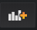
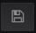

# B-1 SORACOM Lagoon で通知を送る

SORACOM Harvest Data に蓄積されたデータを基に、SORACOM Lagoon で通知を送ってみます。

## SORACOM Lagoon とは

SORACOM Lagoon はダッシュボード作成/共有サービスです。  
データ収集、蓄積サービス SORACOM Harvest に集められたデータを対象に目的に応じて複数のグラフ、テーブル、地図等を組み合わせたダッシュボードを作成し、それらを共有できる他、条件に応じて様々なサービスへ通知を送ることができます。

詳細は [SORACOM Lagoon サービス紹介ページ](https://soracom.jp/services/lagoon/) をご覧ください。

## SORACOM Lagoon の有効化と SORACOM Lagoon ユーザの作成

### ボタンを借りた方 (SAM ユーザでログイン)

左上の [Menu] から [データ収集・蓄積・可視化] > [SORACOM Lagoon] を開きます。

[ユーザー追加] をクリックします。

SORACOM Lagoon ユーザを作成します。以下のように設定してから [追加] をクリックします。

- 権限: **編集可能**
- メールアドレス: 運営から入手 (Lagoon メールアドレス列)
- パスワード: 運営から入手 (Lagoon パスワード列)

[SORACOM Lagoon Console へアクセス] をクリックします。

### ボタンを持ち込んだ方 (ルートアカウントでログイン)

左上の [Menu] から [データ収集・蓄積・可視化] > [SORACOM Lagoon] を開きます。

[SORACOM Lagoon の利用を開始する] をクリックして、表示されたダイアログでは "Free" を選択し、[続行する] をクリックします。

初期の SORACOM Lagoon ユーザーのパスワードを設定します。すべて☑が付くようになるようなパスワードを設定して [利用開始] をクリックします。

[SORACOM Lagoon Console へアクセス] をクリックします。

## SORACOM Lagoon へのログイン

SORACOM Lagoon へのログイン画面が表示されます。下記の情報でログインしてください。

- メールアドレス: ルートユーザーのメールアドレス、もしくは Lagoon メールアドレス列)
- パスワード: 先ほど設定したパスワード、もしくは Lagoon パスワード列

## 通知チャンネルの作成

SORACOM Lagoon へログイン後、左のメニューから通知チャンネルを作成します。

[鈴のアイコン] > [通知チャンネル] > [チャンネルを追加] と進みます。

新しい通知チャンネルを追加で、以下のように入力します。

- 名前: `メール` (任意の文字列)
- タイプ: **Email**
- 全てのアラートで送信: (チェックせず)
- Email Addresses: 通知の送信先のメールアドレスを記載してください

入力が終わったら、まず [送信テスト] をクリックします。

このようなメールが届けば設定成功です。

"新しい通知チャンネル" の画面に戻り [保存] をクリックしてください。

## 新規ダッシュボードの作成

SORACOM Lagoon でダッシュボードを作成します。

[＋のアイコン] > [ダッシュボード] と進みます。

## 新規グラフパネルの作成と設定

"New Panel" が表示されている場合は [Add] > [Graph] と進みます。  
（もしも "New Panel" が表示されていない場合は、画面右上の  をクリックすると "New Panel" が表示されます）

グラフ（まだデータはありませんが）が表示されたら "Panel Title" となっている部分をクリックし [編集] と進みます。

### メトリックタブ

[メトリック] タブをクリックした後、以下のように設定します。

- データソース: **default**
- **Air** / [LTE-M Button の SIM を選択]  / **Standard** / **clickType**

### 表示タブ

[表示] タブをクリックした後、以下のように設定します。

- 描画モード
    - 棒 (チェックをつける)
    - 線 (チェックを外す)

ここまで設定したら、画面右上の  をクリックし、ダッシュボードを保存します。  
ダッシュボード名は任意で構いません。

ダッシュボードに戻ったら、再度 [Panel Title] > [編集] を開き、設定を続けます。

### アラートタブ

[アラート] タブをクリックした後、以下のように設定します。

#### アラート設定

- 条件:
    - WHEN `last()`
    - OF `query(A, 1m, now)`
    - **IS ABOVE** `0`
- データが無いか全ての値が Null の時: **Ok**

#### 通知

- 送り先: **メール** (通知チャンネルで作成した名前を選択)

ここまで設定したら、画面左上の  をクリックし、ダッシュボードを保存します。  

## 通知を試してみる

ボタンを押すと、それに対応してメールに通知されます。

**注意点;**

- 次の通知は、通知発生後１分※以上経過してから受け取ることができます。これは過剰な連続通知を避けるための仕組みです。
- 2019年10月時点では通知発生後１分※を経過する "OK" のステートの通知が発生しますが、これは正常な動作です。

※ SORACOM Lagoon のプランによって異なります。Freeプランは最小60秒。Proプランでは5秒です。

# 以上で本ページの作業は完了となります

## トラブルシュート
