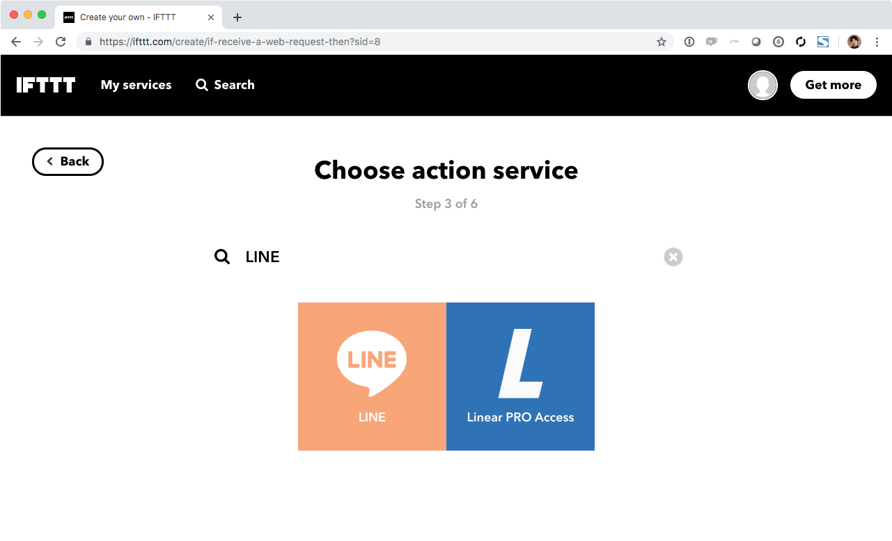
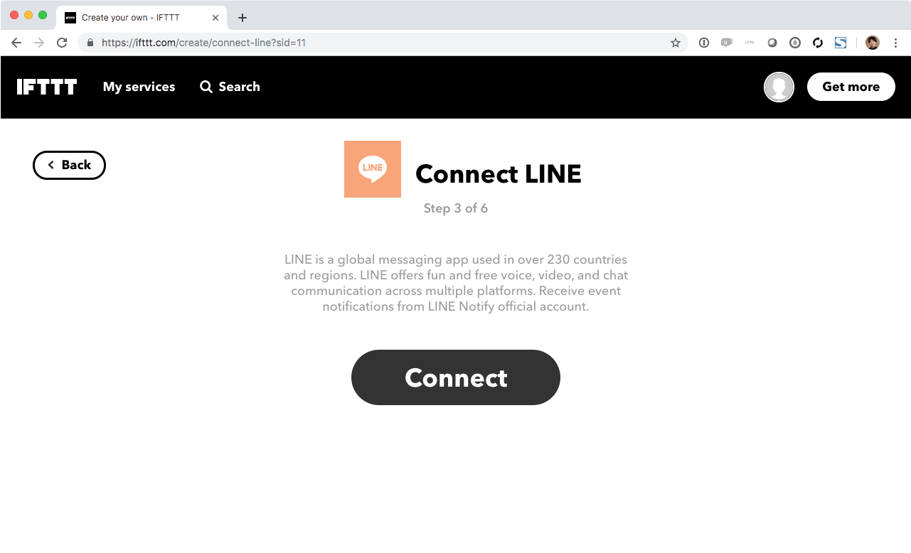
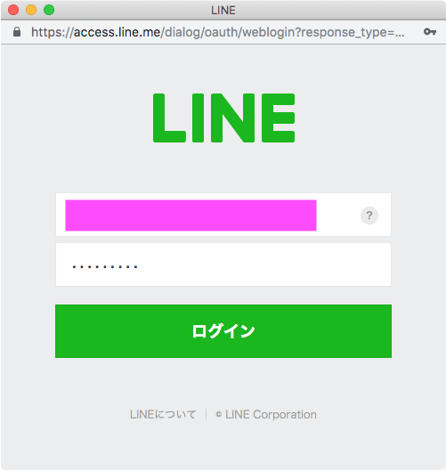
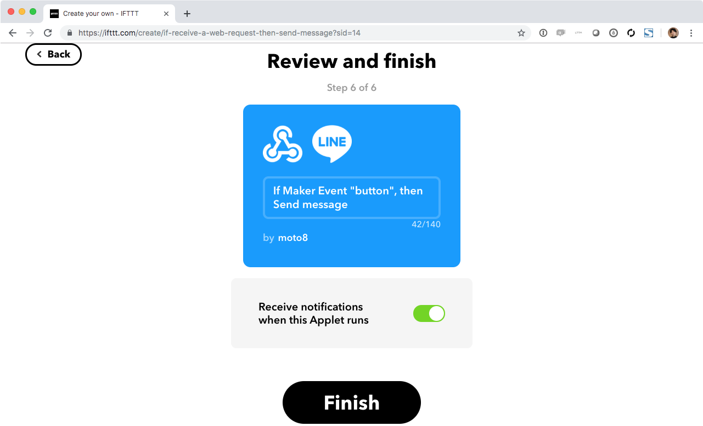
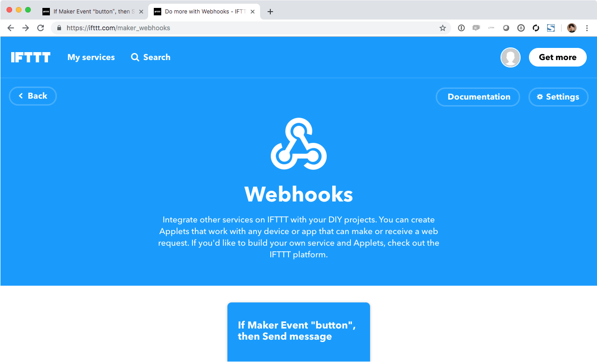
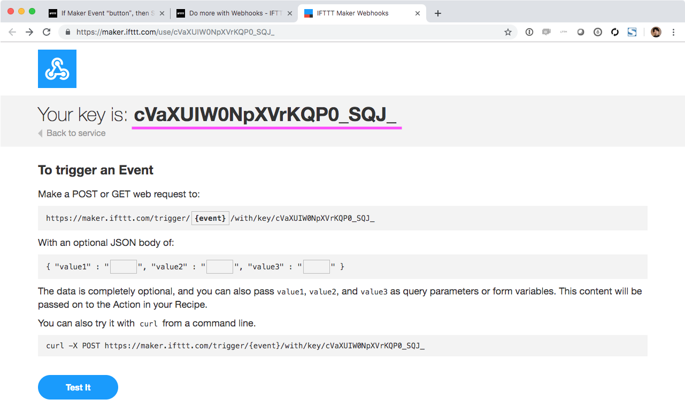

# IFTTT を使って LINE に送信

[目次に戻る](../index#work-b)

IFTTT と呼ばれる中継サービスを経由して LINE にメッセージを送ってみます。


## 作業1: LINE Notify の設定を行う

LINE へのメッセージ送信に使用する LINE Notify の設定を行います。

[LINE Notify](https://notify-bot.line.me/ja/){:target="_blank"} 右上のログインから LINE のアカウントでログインしてください。  
※ この時点で LINE にログイン記録が通知されます

ログイン出来れば設定は完了です。  
マイページから連携中のサービスが確認/管理ができます。

### LINE Notify にログインするためのメールアドレスを確認する方法

[LINE Notify ヘルプセンター / 登録しているメールアドレスを確認するには？](https://help.line.me/line/?contentId=20000056) をご覧ください。

## 作業2: IFTTT の設定を行う

### IFTTT のアカウントを作成する

[IFTTT Sing up](https://ifttt.com/join){:target="_blank"} からアカウントを作成してください。

Google(gmail) アカウントや Facebook アカウントを利用して作成もできますし、下の `sign up` からメールアドレスでの作成も可能です。

### 設定を新規作成する

[Create your own - IFTTT](https://ifttt.com/create){:target="_blank"} を開いて `This` をクリックします。


[Search services] の所に、`webhooks` とタイプし Webhooks のアイコンをクリックします


`Connect` を押します


`Receive a web request` をクリックします。


Event Name 欄に `button` と入力し、 `Create trigger` をクリックします。

> 必ず 小文字で `button` と指定して下さい


`That` をクリックします。


[Search services] に `LINE` と入力し、 LINE のアイコンをクリックします。



`Connect` をクリックします。

> 既に LINE Notify に Connect 済みだったり、 Google アカウントや Facebook アカウントで IFTTT にログインした場合、この手順はスキップされて後述の "Send message" が表示される場合がありますが正常です。後述の "Send message" の手順から続けてください。



LINE アカウントに登録されているメールアドレス・パスワードでログインします。



> もしメールアドレス認証を指定ない場合には、まず　LINE アプリからメールアドレス認証を行う必要があります


Send message をクリックします。


Message 欄を以下のように変更し Create action をクリックします。

> `ボタン {{Value1}} が {{Value2}} クリックされました<br>{{Value3}}`


Finish をクリックします。

> トリガー時にアプリ通知が必要ない場合には `Receive notifications when this Applet runs`　をオフにします



[Webhooks](https://ifttt.com/services/maker_webhooks/){:target="_blank"} のページを開き、Documentation をクリックします。



`Your key is:` の後ろの文字列をどこかにメモしておきます。



以上で IFTTT の設定は終了です。

## 作業3: AWS Lambda を作成する

AWS IoT 1-Click から呼び出され、IFTTT に送信する Lambda 関数を作成します。

[AWS マネジメントコンソール](https://console.aws.amazon.com/console/home) を開きログインしたあと、リージョンが **オレゴン** (us-west-2) になっている事を確認します。  
なっていなければ **オレゴン** に切り替えてください。


[AWS Lambda](https://eu-west-2.console.aws.amazon.com/lambda/home?region=eu-west-2#){:target="_blank"} のコンソールを開き、 [関数の作成] をクリックします。

**一から作成** を選んだあと、以下のように入力して [関数の作成] をクリックします。

* 名前: `1click-ifttt` (任意の文字列)
* ランタイム: _Node.js 8.10_
* （アクセス権限は編集する必要はありませんが、選択する場合は `基本的な Lambda アクセス権限でロールを作成` を選んでください）

関数コードでは、以下のようにします。

* ハンドラ: `index.handle` (デフォルトで `index.handler` と入っています。**必ず直すようにしてください**)

コードを以下の URL のコードと入れ替えて [保存] をクリックします。  
[https://github.com/j3tm0t0/1-click/blob/master/functions/ifttt/index.js](https://github.com/j3tm0t0/1-click/blob/master/functions/ifttt/index.js){:target="_blank"}


メールの時同様に、テストを作成します。  
テストイベントは以下の JSON を使います。その際、以下の値を変更してください。

* event: IFTTT で設定した `Event Name` (テキスト通りの場合は `button` になります)
* key: IFTTT の Webhooks で入手したキー

```json
{
  "deviceEvent": {
    "buttonClicked": {
      "clickType": "SINGLE",
      "reportedTime": "2018-05-04T23:26:33.747Z"
    }
  },
  "deviceInfo": {
    "attributes": {},
    "type": "button",
    "deviceId": " G030PMXXXXXXXXXX ",
    "remainingLife": 5
  },
  "placementInfo": {
    "projectName": "TestProject",
    "placementName": "button1",
    "attributes": {
      "event": "button",
      "key": "`IFTTT` の Webhook key を入れる",
      "value1": "値1",
      "value2": "値2",
      "value3": "値3"
    },
    "devices": {
      "myButton": " G030PMXXXXXXXXXX "
    }
  }
}
```

AWS Lambda 上でテストをして LINE Nofity からメッセージが届けば成功です。

## 作業4: AWS IoT 1-Click の設定を行う

### デバイスの確認

今から行う作業の対象デバイスがすでに別のプレイスメントに割り当てられていると作業が継続できないため、あらかじめ [プレイスメントからデバイスの割り当てを外す](../unassing-placement) を参考に行ってください。

### プロジェクト/プレイスメントの作成

[管理] > [プロジェクト] とクリックした後、[作成] をクリックします。

以下、プロジェクト内での設定です。

* ステップ 1/2
    * プロジェクト名: `IFTTT` (任意の文字列)
* ステップ 2/2
    * デバイステンプレートの定義: 全てのボタンタイプ
    * デバイステンプレート名: `IFTTT` (任意の文字列 (プロジェクト名と異なってもＯＫ))
    * アクション: Lambda 関数の選択
        * AWS リージョン: オレゴン
        * Lambda 関数: `1click-ifttt` (先ほど作成した Lambda 関数)
    * プレイスメントの属性
        * `event` = (IFTTT で設定した `Event Name`)
        * `key` = (IFTTT の Webhooks で入手したキー)
        * `value1` = `朝` (任意の文字列)
        * `value2` = `昼` (任意の文字列)
        * `value3` = `晩` (任意の文字列)


[プレイスメントの作成] をクリックした後、プレイスメント内での設定を以下のようにします。

* デバイスのプレイスメント名: `button1` (任意の文字列)
* デバイスの選択: 割り当てたいデバイスを選択
    * プレイスメントに未割り当てのボタンのみが表示されます

以上で終了です。

### 作業5: ボタンからの動作を確認してみる

SORACOM LTE-M Button を押してメッセージが届くか確認してください。

#### いろいろ試してみる

* AWS IoT 1-Click のプレイスメントの属性における value1 などを編集してみてください
* IFTTT のアプレットにおける Message を変更してみたり、 Photo URL を入れてみてください。
    * Photo URL で使える画像のサンプル URL: https://blog.soracom.jp/images/2018-07-04-soracom-lte-m-button/soracom-lte-m-button-powered-by-aws.png

#### あとかたづけ

作業は任意です。

* IFTTT と LINE の接続を切断する
    * [IFTTT の Services から LINE](https://ifttt.com/line){:target="_blank"} を選択、Settings で *Remove LINE* で切断。
    * [LINE Notify のマイページ](https://notify-bot.line.me/my/){:target="_blank"} の連携中サービスで IFTTT との接続を解除
* AWS 関連
    * Lambda 関数の削除 (残っていても実行されない限りは費用は発生しません)
    * IAM ロール (自動生成のロールは `Lambda 関数名-role-ランダム文字` となります。テキストに沿って作った場合は `1click-ifttt-role-ランダム文字` となっています)
      * IAM ポリシー (自動作成のポリシーは `AWSLambdaBasicExecutionRole-ランダム文字` となります。自動作成されたロールから参照されているポリシーを削除してください)
    * AWS IoT 1-Click のプロジェクトの削除

---

* [目次に戻る](../index#work-b)
