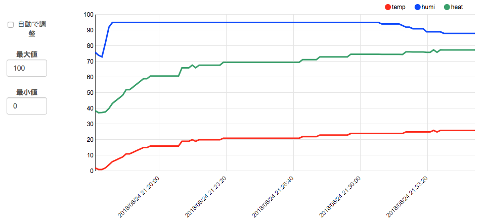
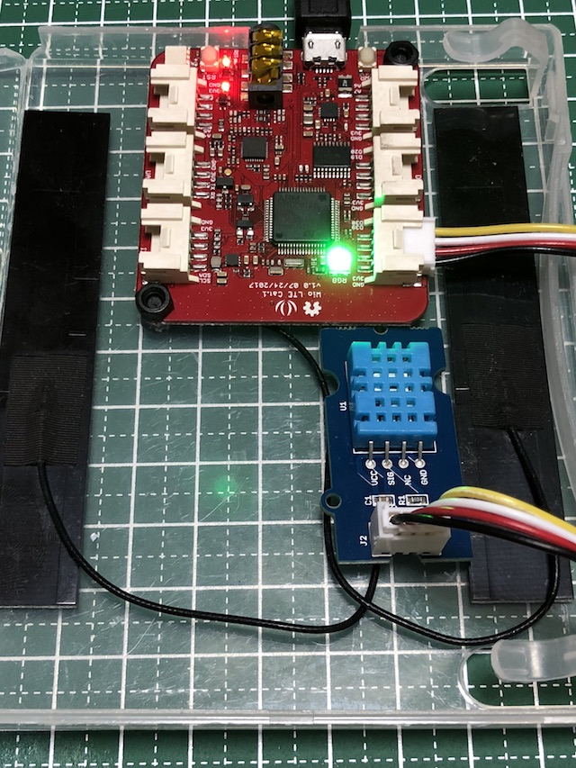

# 室内環境センシング
空気の状態をモニタリングするためのスケッチです。
起動すると、温湿度を計測してそこから不快指数を計算し、SORACOM Harvest にデータを送信します。
また不快指数に応じて LED の色を変更します(涼しい時には青色、ちょうどいい時には緑色、暑い時には赤色)。



# 配線
D38 に「GROVE - デジタル温度・湿度センサ」を接続します。



# スケッチ解説
基本的には、Wio LTE for Arduino ライブラリのサンプル soracom-harvest スケッチをベースに、不快指数の計算部分とそれに応じた LED 色の設定を加えました。

不快指数の計算式は、
```
heat = 0.81*temp + 0.01*humi*(0.99*temp-14.3) + 46.3;
```
のようになっています。
