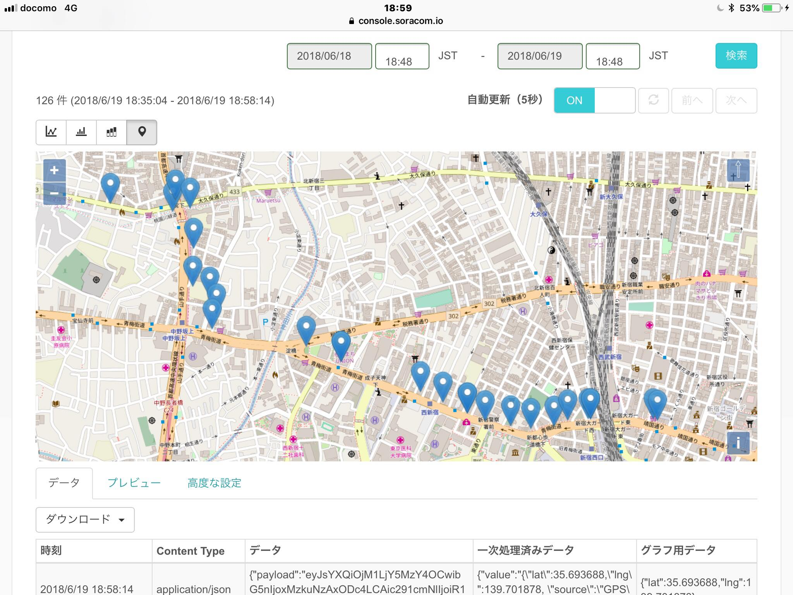
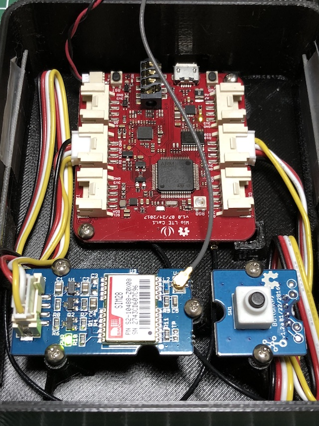
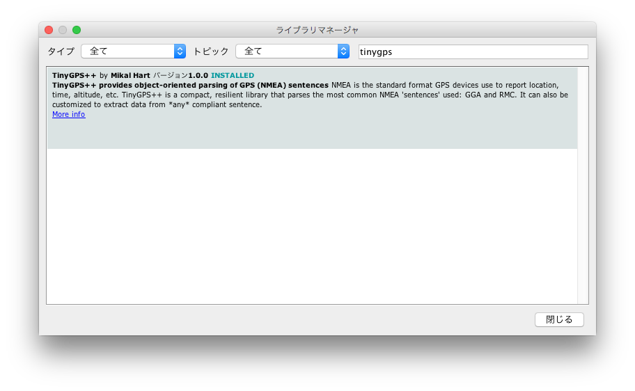

# GPS トラッカー
WioLTE を GPS トラッカーとして使うスケッチです。GPSモジュールを接続して電源を入れれば、GPSの座標を SORACOM Harvest に送信します。SORACOM Harvest の位置情報データ表示モードを使うことで、簡単に GPS データの可視化が行えます。
GPSモジュールが接続されていない場合や、GPS モジュールの測位が出来ていない場合には、LTE の基地局情報を元に大雑把な位置を求めることが出来ます。

# 配線
UART 端子に GPS モジュールを接続します。
D20 端子にボタンを接続しておくと、ボタンを押した時にすぐデータを送信します。

# スケッチについて
TinyGPS++ ライブラリが必要です。
スケッチ→ライブラリをインクルード→ライブラリを管理、から tinygps で検索してインストールして下さい。

# 謝辞
本スケッチは、下記の記事のスケッチを参考にしました。
[Wio LTEでGPS情報を取得した情報をSORACOM Harvestの地図プレビューで見る - Qiita](https://qiita.com/cactanaka/items/95172b2c9fa9065cd1f6)
