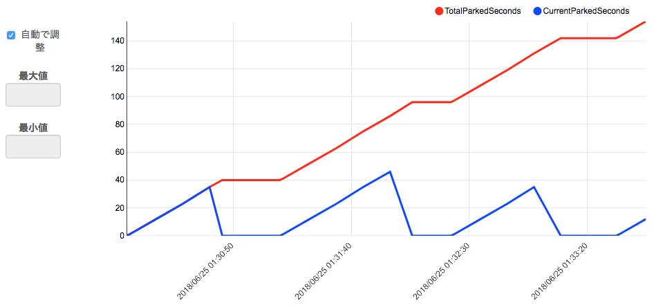
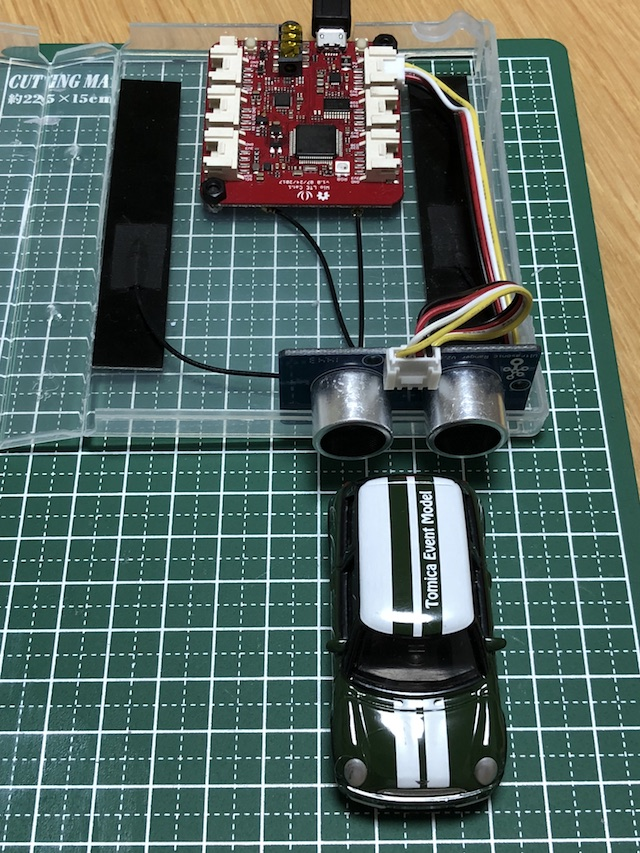
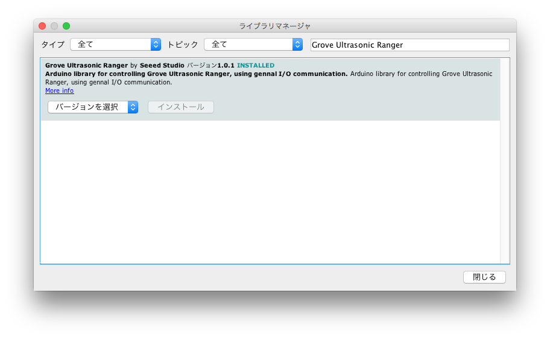

# 駐車場管理
WioLTE で 駐車場の管理を行うスケッチです。超音波距離センサーを使って車がとの距離を計測し、一定の距離以下であった時は駐車しているとみなします。

現在の車が駐車している時間と、のべ駐車時間を Harvest に送信し、グラフにします。

# 配線
A6 端子に 超音波センサーを取りつけます。

# スケッチについて
Grove Ultrasonic Ranger ライブラリが必要です。
スケッチ→ライブラリをインクルード→ライブラリを管理、から grove ultra ranger で検索してインストールして下さい。

