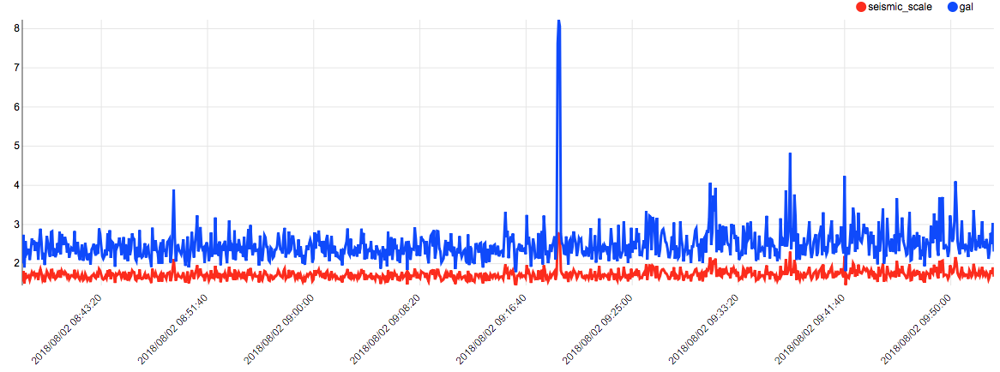

# 地震計
起動すると、秒間100回加速度(単位 Gal = 100 ㎡/s)を計測し、５秒毎の最大震度を計算して、SORACOM Harvest に送信します。
また震度に応じて LED が 緑〜黄色〜赤 と変化し、震度３よりも大きい場合にはブザーが鳴ります。

# 配線
I2C に「GROVE - I2C 三軸加速度センサ ADXL345搭載」を接続します。
A4 に 「GROVE - ブザー」を接続します。

> TODO 写真撮影

# スケッチ解説
震度の算出には、https://github.com/p2pquake-takuya/rpi-seismometer のプログラムを参考にしました。

# 参考情報リンク
- https://www.p2pquake.net/dev/rpi_seismometer/calculate/
- https://github.com/p2pquake-takuya/rpi-seismometer
- http://www.data.jma.go.jp/svd/eqev/data/kyoshin/kaisetsu/calc_sindo.htm
