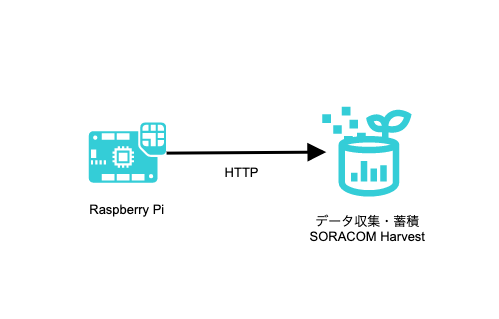

# SORACOM Harvest を使用した IoT データの蓄積、保存

本章では SORACOM Harvest を使用して Raspberry Piからのデータを受信、蓄積する様子を確認します。

## ハンズオンのゴール

Raspberry Piからデータを送信し、Harvestでデータが保存されることを確認します。



## 1. SORACOM Harvest の設定をする

[SORACOM Webコンソール](https://console.soracom.io/) で 左上[Menu] > [SIM グループ]をクリックします


[追加] で、SIMグループを作成します。グループ名は`handson-<お名前>`と入力します。(既にグループが作成済みの場合は飛ばしてください)


先ほど作成した SIMグループ をクリック、SORACOM Harvest のアコーディオンメニューを開き、設定を ON にして保存をクリックします


続いて、SIMグループにSIMを追加します。左上[Menu] > [SIM 管理]をクリックします


SIM を選択 > [操作] > [所属グループ変更]をクリックします


先ほど作成した SIMグループ に SIM を所属させます


以上で SORACOM Web コンソール上での作業は終了です。SIM の "グループ" が、先ほど作った SIM グループ名になっていれば成功です


## 2. 動作確認

Raspberry PiにSSH接続している端末上で以下のコマンドを何度か実行します

```console
cat /proc/uptime | cut -d ' ' -f 1 | echo '{"uptime": '$(cat)'}' | curl -X POST http://uni.soracom.io -d @-
```

[SORACOM Webコンソール](https://console.soracom.io/) で 左上[Menu] > [SIM 管理]をクリックします


SIM を SORACOM Webコンソール上で選択し [操作] > [データを確認]をクリックします


下図のように SORACOM Harvest 上で稼働時間が表示されるようになります  
※自動更新を ON にすると、画面の再描画が自動的に行われます  
※グラフ種類を折れ線グラフや棒グラフに変更することができます


これでSORACOM Harvest を使用して Raspberry Piからのデータを受信、蓄積する様子が確認できました。

## 以上で本章は終了です

* [目次ページへ戻る](index.md)
