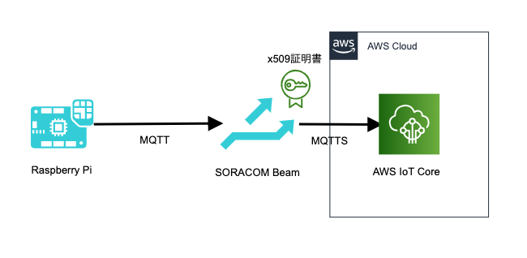
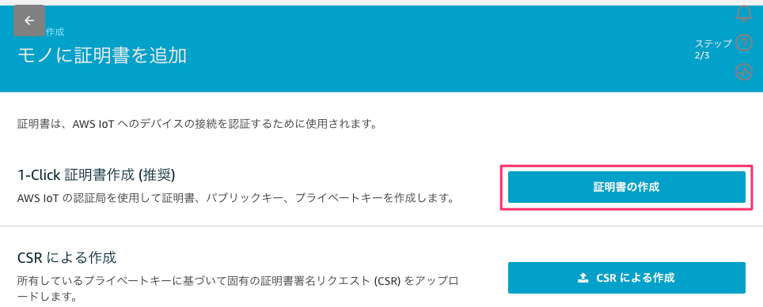
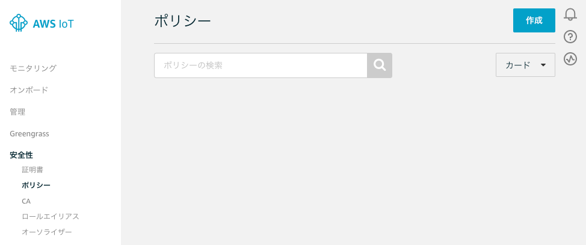
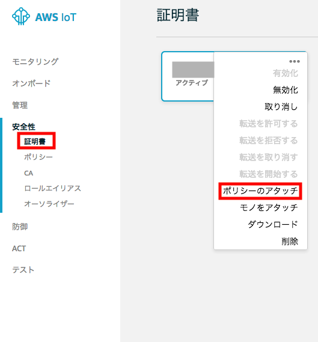

# SORACOM Beam を使用した IoT データの AWS への連携

本章では SORACOM Beam を使用して Raspberry PiからMQTTのデータを AWS に連携します。

## ハンズオンのゴール

Raspberry PiからデータをMQTTで送信し、Beam によってデータに x509証明書を付与、MQTTSで AWS IoT Coreに接続できることを確認します。



## 1. AWS IoT Core証明書の発行

以下の手順でAWS IoTのx509証明書を発行し、SORACOMのクレデンシャルとして登録します。

[AWS IoT コンソール](https://ap-northeast-1.console.aws.amazon.com/iot/home?region=ap-northeast-1#/home)を開き AWS IoT の設定を開始します。

メニューから 安全性 を選択し、証明書を作成します。右上の「作成」をクリックして1-Click証明書作成の「証明書の作成」ボタンをクリック、証明書を作成します。



下記の３つの証明書をダウンロードのリンクよりダウンロードします(後ほど使用します)。

- このモノの証明書 (ファイル名 : `<証明書ID>-certificate.pem.crt`)
- プライベートキー (ファイル名 : `<証明書ID>-private.pem.key`)
- AWS IoT のルート CA → [サーバー認証] - [Amazon Trust Services エンドポイント (推奨)] - [Amazon ルート CA 1](右クリックし、ファイルとして保存、ファイル名 : `AmazonRootCA1.pem`)

また、「有効化」をクリックして証明書を有効化し、「完了」をクリックします。


次に 安全性 > ポリシー > ポリシーの作成からデバイスに割り当てるポリシーを作成します。



今回はどの MQTT topic にも Publish, Subscribe 可能なポリシーを作成します。
下記のように入力して [作成] をクリックします。

- 名前 : `PubSubToAnyTopic-<お名前>`
- アクション : `iot:*`
- リソースARN : `*`
- 効果 : 「許可」のチェックをオン

次に作成したポリシーを作成したモノの証明書へ紐付けます。

安全性 > 証明書 を選択し、先ほど作成した証明書の右上の […] から [ポリシーのアタッチ] をクリックします。



先ほど作成した「PubSubToAnyTopic-<お名前>」を選択し、[アタッチ] をクリックします。


以上で AWS IoT Core へのモノの登録が完了しました。

このあとの手順のために、AWS IoTコンソールのメニュー [設定] にある「エンドポイント」をコピーしておきます。

## 2. SORACOMへのクレデンシャル登録

SORACOMユーザーコンソールに先ほど作成した証明書を登録します。

SIMのIMSIをクレデンシャル名に含めるため、SIM管理から自身のSIMを選択、[詳細]ボタンをクリックしIMSIをコピーします。


SORACOM ユーザーコンソールから、右上のオペレータメニューから「セキュリティ」を選択します。


メニューの「認証情報ストア」から「認証情報を登録」を選択します。


以下の内容を入力し、「登録」をクリックします。
ファイルのダウンロード時とは順番が異なることに注意します。

- 認証情報ID : `handson-aws-iot-<お名前>`
- 概要 : 空欄のまま
- 種別 : 「X.509証明書」を選択
- 秘密鍵 (key) : `<証明書ID>-private.pem.key` ファイルの内容をペースト
- 証明書 (cert) : `<証明書ID>-certificate.pem.crt` ファイルの内容をペースト
- CA証明局 : `AmazonRootCA1.pem` ファイルの内容をペースト


これでクレデンシャルの構成は完了です。

## 3. SORACOM Beamの設定

SIMグループで SORACOM Beam を有効にします。まだSIMグループを作成していない場合は以下の手順で作成してください。作成済みの場合は手順3-2に進んでください。

### 3-1. SIMグループの作成とSIMの割り当て

[SORACOM Webコンソール](https://console.soracom.io/) で 左上[Menu] > [SIM グループ]をクリックします


[追加] で、SIMグループを作成します。グループ名は`handson-<お名前>`と入力します。


続いて、SIMグループにSIMを追加します。左上[Menu] > [SIM 管理]をクリックします


SIM を選択 > [操作] > [所属グループ変更]をクリックします


先ほど作成した SIMグループ に SIM を所属させます


SIM の "グループ" が、先ほど作った SIM グループ名になっていれば成功です

## 3-2. SORACOM Beamの設定

SORACOMユーザーコンソールのメニューから[SIMグループ]をクリックします。グループ設定からSORACOM Beamアコーディオンメニューを開き、[+] - [MQTTエンドポイント]をクリック、以下を入力して Beam を有効化します。

- 種別: `Standard MQTT Broker`のまま
- プロトコル: 「MQTTS」を選択
- ホスト名: 手順1でコピーしたAWS IoT Coreのエンドポイント
- ポート番号: 8883
- ユーザー名,パスワード,パススルー: 空欄/OFFのまま
- 証明書: ON
- 認証情報: `handson-aws-iot-<お名前>` を選択

[保存]ボタンをクリックして設定完了です。

## 4. SORACOM Beamの動作確認

SORACOM IoT SIMをセットしたデバイスからSORACOM BeamにMQTT接続し、AWS IoT Coreにアクセス出来る様子を確認します。

SORACOMユーザーコンソールのメニューから[SIM管理]をクリック、自分のSIMを選択して[操作] - [所属グループ変更]をクリック、自分のSIMグループを選択し[グループ変更]をクリックします。

デバイスにログインし、MQTTクライアントである `mosquitto_pub` コマンドを実行、SORACOM Beamに接続します。

```
$ mosquitto_pub -d -h beam.soracom.io -t <お名前> -m "test"
(以下は実行結果の例です)
Client mosqpub|3518-raspberryp sending CONNECT
Client mosqpub|3518-raspberryp received CONNACK (0)
Client mosqpub|3518-raspberryp sending PUBLISH (d0, q0, r0, m1, '<お名前>', ... (4 bytes))
Client mosqpub|3518-raspberryp sending DISCONNECT
$
```

AWS IoT管理画面のメニューから「テスト」を選択、「トピックのサブスクリプション」に「<お名前>」トピックを入力し、「トピックへのサブスクライブ」をクリックしてサブスクライブを開始します。

何度か `mosquitto_pub` コマンドを再実行し、画面の右下にデバイスからパブリッシュしたメッセージが表示されることを確認します。


これで、SORACOM Beamによって適切なX.509証明書が付与されAWS IoT Coreで認証し、正常に動作することが確認できました。

## 以上で本章は終了です

* [目次ページへ戻る](index.md)
