# ユーザーコンソールを利用してSORACOM IoT SIMを管理する
## SORACOM アカウントの作成
[アカウント作成ページ](https://console.soracom.io/#/signup)にアクセスし、 使用する SIM の種類を選択します。
日本向けの SORACOM IoT SIM を利用する場合は、カバレッジタイプ Japan を選択します。必要事項を入力します。
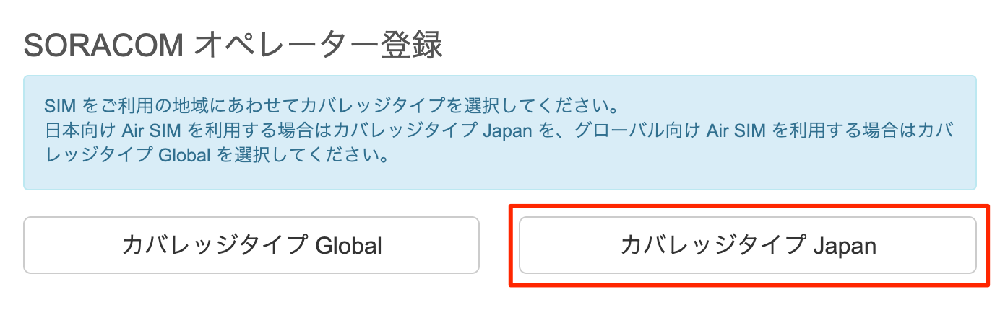

「アカウント作成」画面が表示されますのでメールアドレスおよびパスワードを入力します。 また、契約者が個人であるか法人であるかを選び、法人の場合はさらに契約者の情報を入力します。 最後に規約に同意するためのチェックボックスを入れ、「アカウントを作成」ボタンを押します。
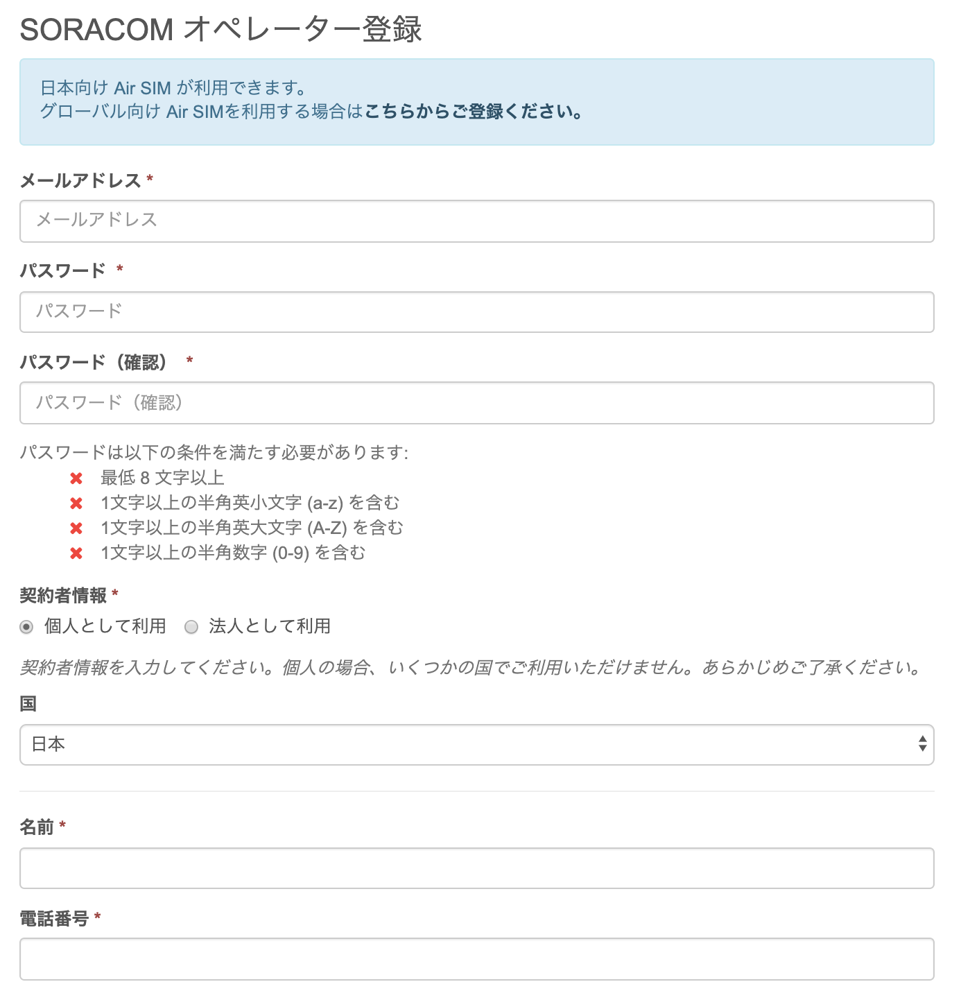

[アカウントを作成]ボタンをクリックします。
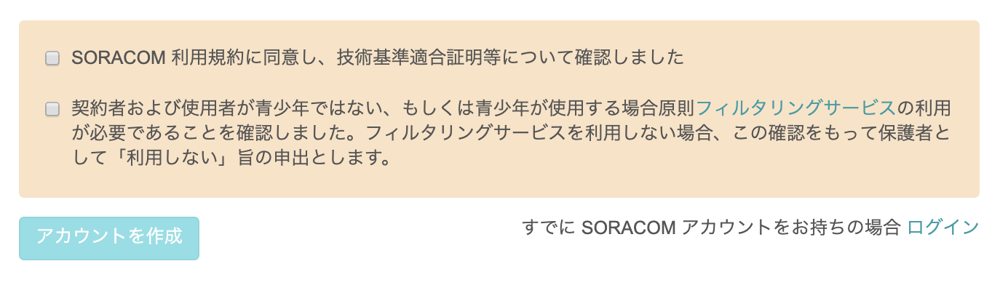
[アカウント作成]ボタンをクリックすると、メール送信完了のメッセージが表示されますので、メールの到着をお待ちください。
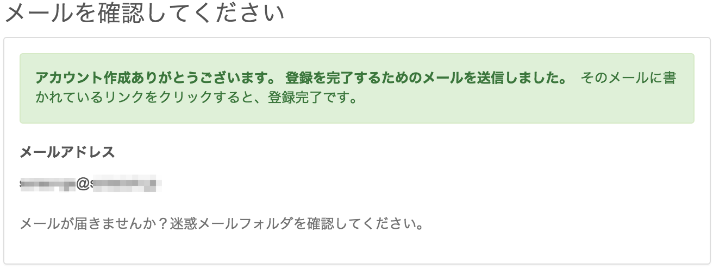

メールが届いたらリンクをクリックしてください。自動的にログイン画面に遷移します。
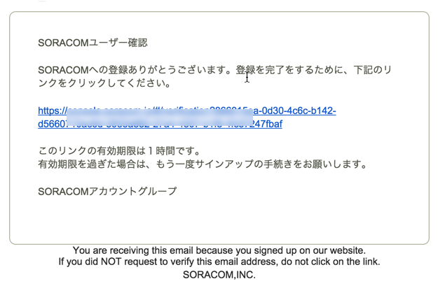

これでアカウントの作成は完了です。続いてユーザーコンソールにログインし、SIM の登録を行いましょう。

## 支払い情報の設定
通信料の支払い方法はクレジットカード払いとなります(法人のお客様は[請求書払い](https://soracom.jp/contact/bill_payment/)にも対応しています)。クレジットカードの情報を登録するには、メイン画面右上のユーザー名が表示されているボタンから [お支払い方法設定] をクリックします。
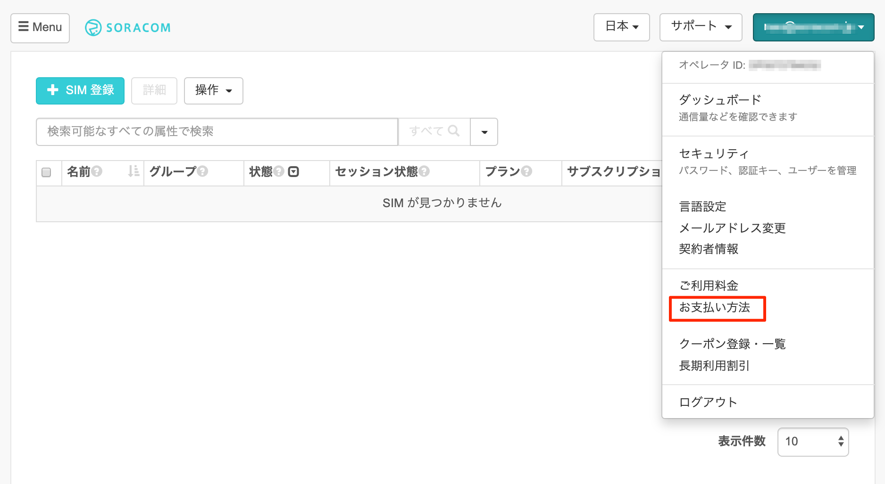

入力画面が表示されたら、入力フォームに沿ってクレジットカード情報を入力します。最後に[登録] ボタンをクリックすると支払い方法の登録完了です。

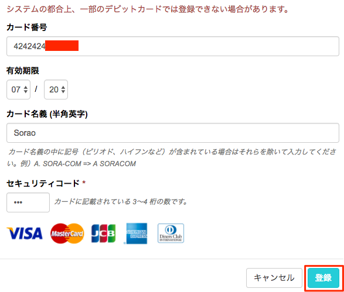

## IoT SIM の登録
[ユーザコンソール](https://console.soracom.io/#/?coverage_type=jp)にログインして、左上の [SIM 登録] ボタンをクリックします。
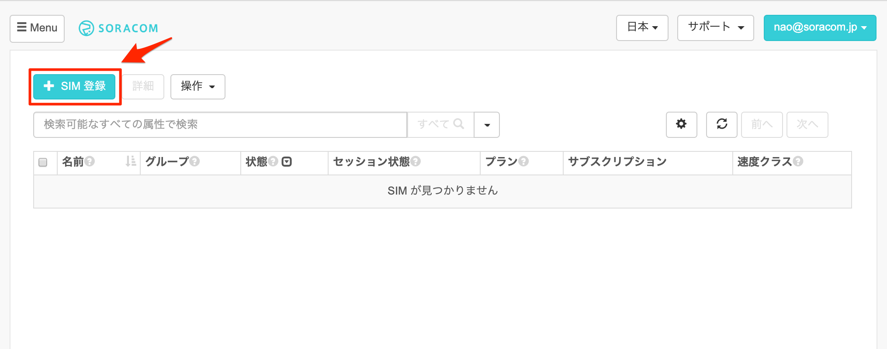

「SIM 登録」画面が表示されたら、IoT SIM の台紙の裏面に貼ってある IMSI と PASSCODE を入力してください。
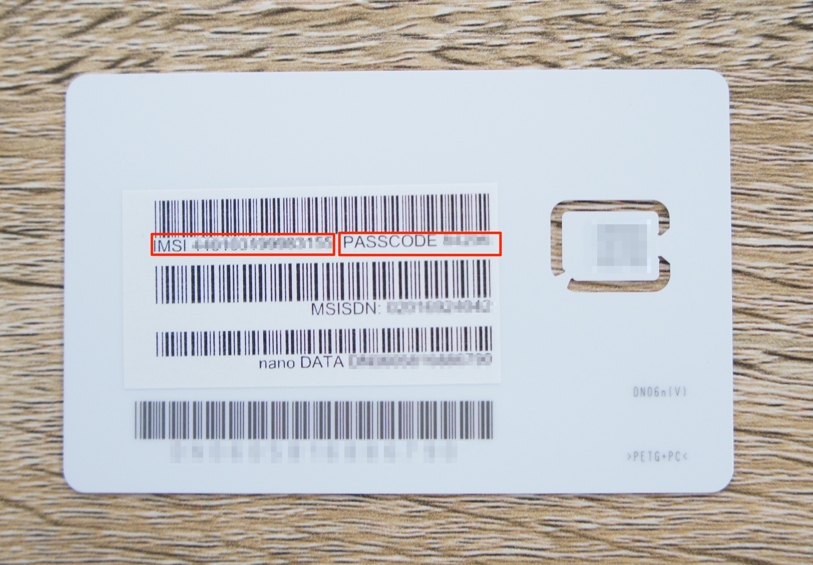

名前、グループは空欄のままでも構いません。[登録] を押して SIM 登録を完了してください。複数の IoT SIM を続けて登録することも可能です。
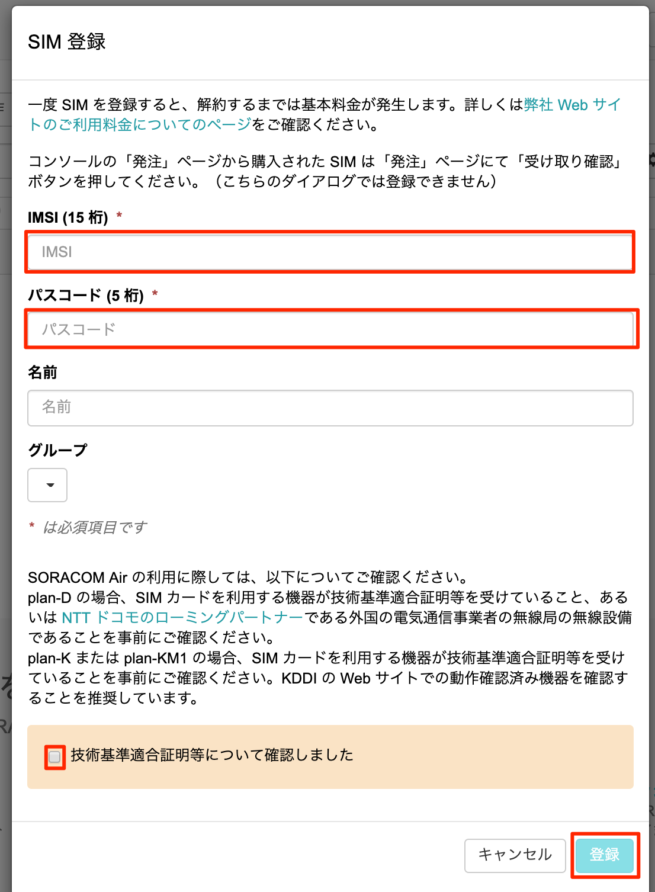


# Appendix

## ユーザーコンソールから通信を確認

### データ通信量の確認
ユーザーコンソールでは、データ通信量をSORACOM IoT SIM(以降 IoT SIM)ごとにチャート形式で確認することができます。
データ通信量を確認したいSIMにチェックを入れ [詳細] ボタンをクリックします。

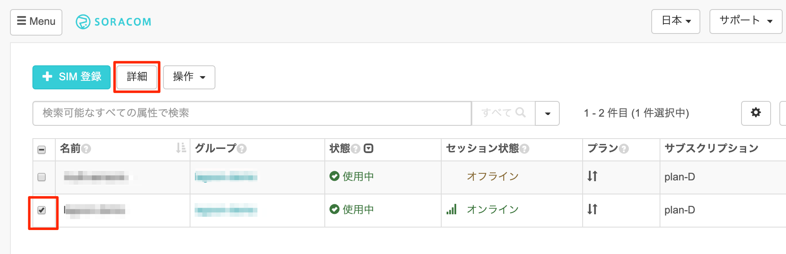

[SIM 詳細] ダイアログが表示されますので、[通信量履歴] タブを開きます。 データ使用量は、表示期間を変更することもできます。

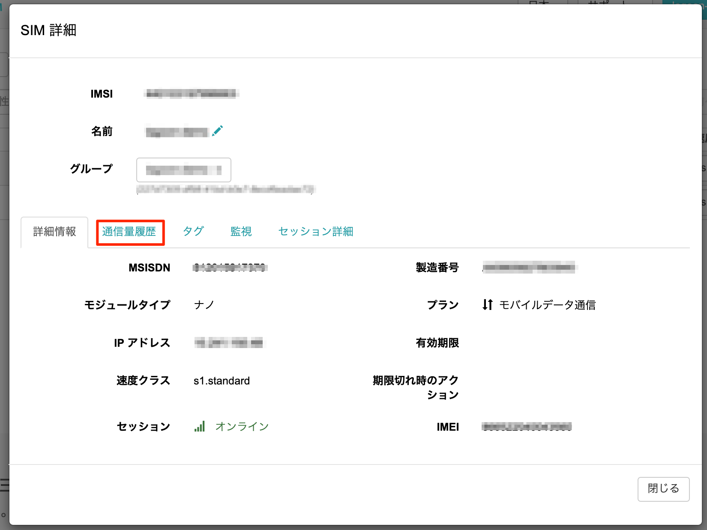

データ通信量が反映されるまでに5〜10分かかりますので、先ほどのデータ通信が反映されていない場合はしばらくお待ちください。

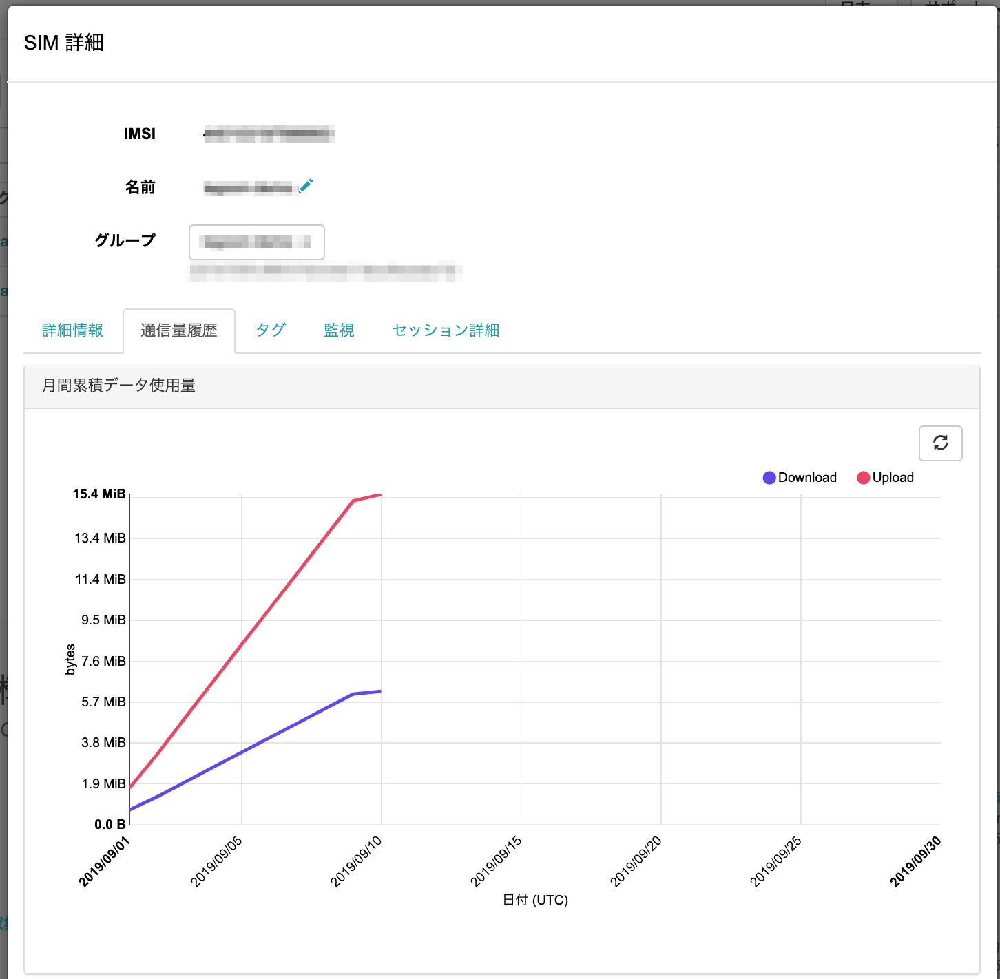
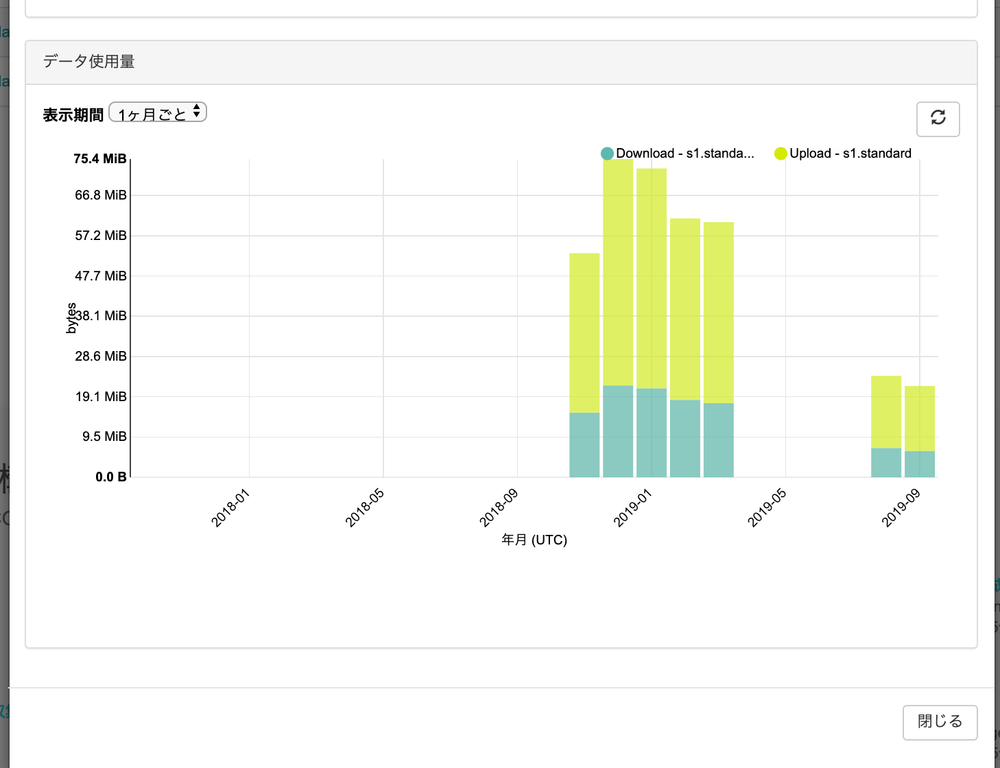

### 利用料金の確認

ユーザーコンソールからデータ通信料金と基本料金を確認できます。画面右上部のプルダウンメニューのボタンを押して [ご利用料金] を選択します。
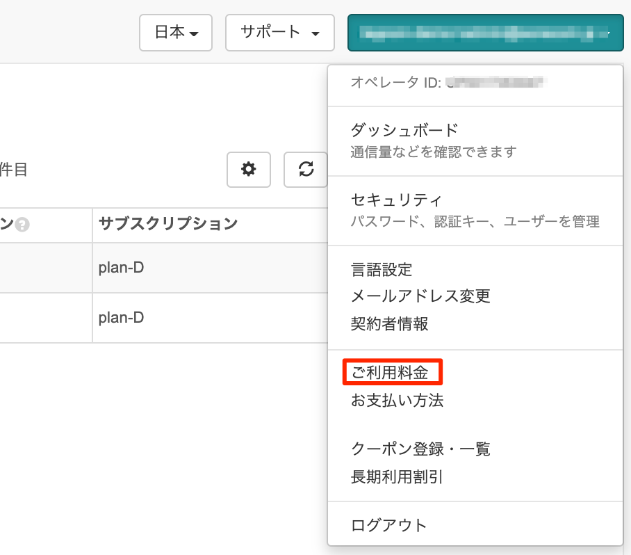

最新の請求予定金額と、過去の請求履歴を確認いただけます。

また、画面下部にある [データ使用量実績データを CSV 形式でダウンロード] から、期間を選択して [ダウンロード] ボタンをクリックすることで、基本料金、転送データ量などの詳細を確認することができます。

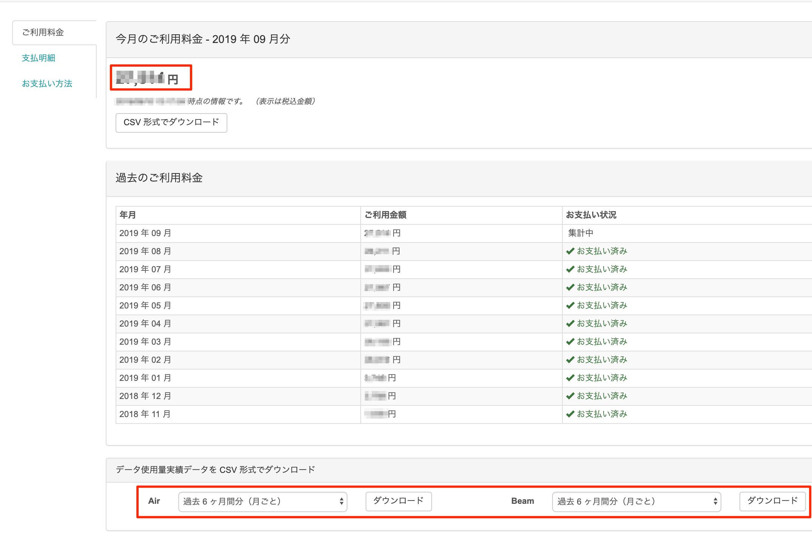

請求額詳細の CSV には、IMSI ごとに以下の項目が記載されています。

```
date (日付)
billItemName (basicCharge は基本料金、upload/downloadDataCharge は転送データ量に対する課金)
quantity (数量: upload/downloadDataCharge の場合の単位はバイト)
amount (金額: 日ごとの料金。この項目の総合計が、月額請求額となります)
タグ、グループ
```

その他詳細については[課金詳細情報CSV](https://dev.soracom.io/jp/docs/billing_detail/)をご参照ください。

### 監視機能の確認
通信量の超過を監視し、超えた場合にメールでの通知と通信帯域制限をできます。監視できる項目は以下のとおりです。

* 各 SIM の日次通信量
* 各 SIM の今月の合計通信量
* 全ての SIM の今月の合計通信

例えば、全ての IoT SIM の合計通信量が 5000MB 以上になった場合にメール通知を受けたい場合や、ある IoT SIM の日次通信量が 100MB 以上になった場合にはその日の通信速度を制限するというような処理を行いたい場合に、この機能を利用できます。

通信量はメガバイト単位 (1以上の整数値) で入力できます。メールの宛先は登録されているメールアドレスです。通信速度を制限した場合は s1.minimum になり、解除された際は、 s1.standard に復帰します。 (API を用いた場合には、制限時の通信速度、制限解除時の通信速度を任意に設定することも可能です)

IoT SIMに監視の設定をしましょう。1MiBで設定してみます。
「SIM詳細」画面で [監視] タブを開き、[SIM] をクリックして、監視設定を行ったら [設定を更新] ボタンをクリックして保存します。

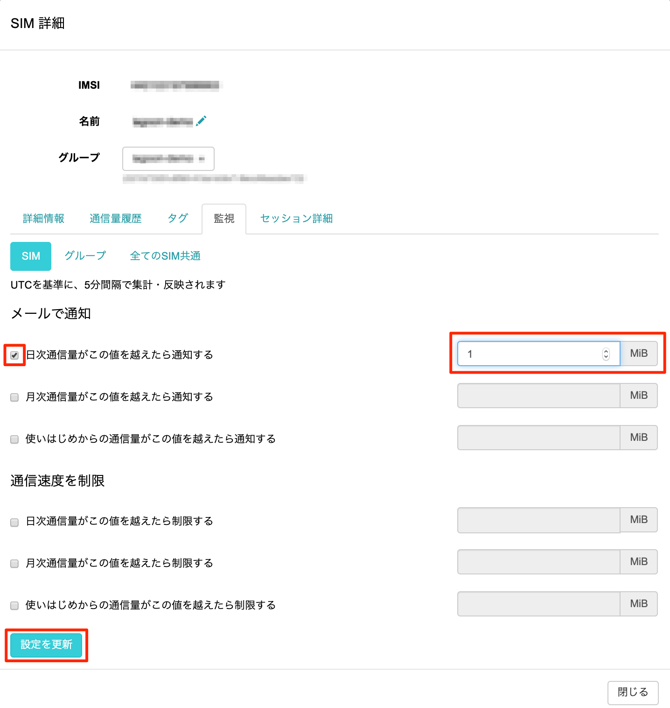

ここでの設定は、対象のIoT SIMごとに有効になります。
監視の設定は、以下の3つを対象することができます。

* IoT SIM
* (IoT SIMの所属する)グループ
* (登録した)全てのSIM
すぐに、メール通知を確認したい場合は、Raspberry Piから以下のコマンドを実行して、1MiBのダウンロードを実施してみてください。

#### コマンド
```
curl -o /dev/null http://soracom-files.s3.amazonaws.com/1MB
```

#### 実行結果
```
pi@raspberrypi:~ $ curl -o /dev/null http://soracom-files.s3.amazonaws.com/1MB
  % Total    % Received % Xferd  Average Speed   Time    Time     Time  Current
                                 Dload  Upload   Total   Spent    Left  Speed
100 1024k  100 1024k    0     0   512k      0 --:--:-- --:--:-- --:--:--  512k
```


以下のような通知が届きます。(通知は最大で5分程度かかります。)

