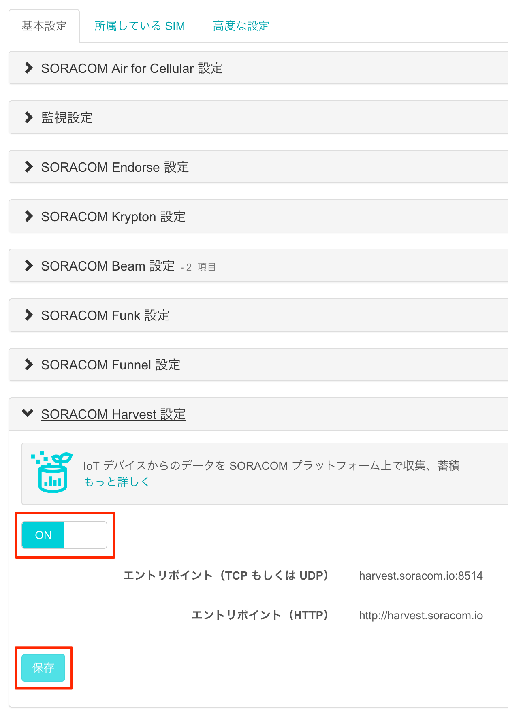
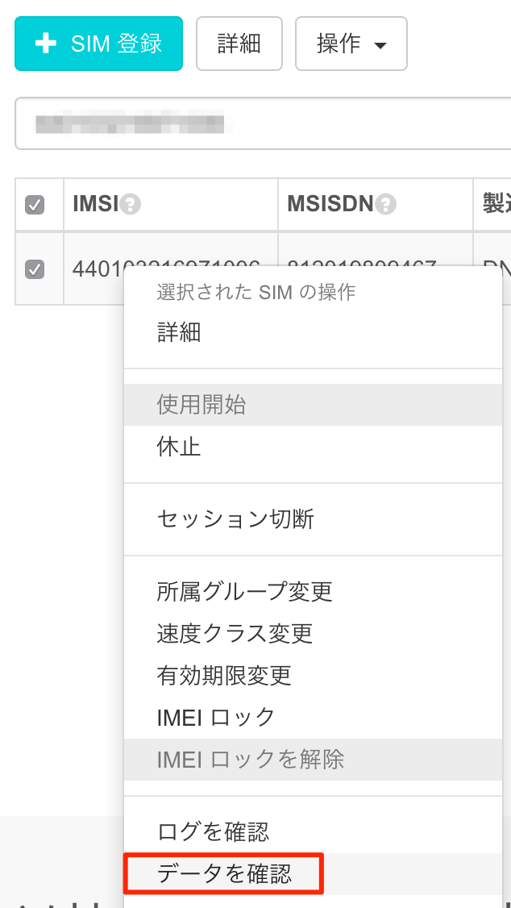
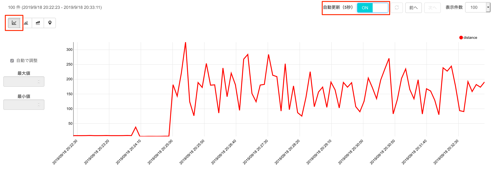

## <a name="6-0">6章 SORACOM Harvest で可視化してみる</a>
SORACOM のサービス、Harvest を体験してみましょう。

### <a name="6-1">SORCOM Harvest とは、</a>
SORACOM Harvest(以下、Harvest) は、IoTデバイスからのデータを収集、蓄積するサービスです。

SORACOM Air が提供するモバイル通信を使って、センサーデータや位置情報等を、モバイル通信を介して容易に手間なくクラウド上の「SORACOM」プラットフォームに蓄積することができます。
保存されたデータには受信時刻や SIM の ID が自動的に付与され、「SORACOM」のユーザーコンソール内で、グラフ化して閲覧したり、API を通じて取得することができます。なお、アップロードされたデータは、40日間保存されます。


> 注意: SORACOM Harvest を使うには追加の費用がかかります
> 書き込みリクエスト: 1日 2000リクエストまで、1SIMあたり 1日5円
> 1日で2000回を超えると、1リクエスト当り0.004円

### <a name="6-2">SORACOM Harvest を有効にする</a>
SORACOM Harvest を使うには、Group の設定で、Harvest を有効にする必要があります。

グループ設定を開き、SORACOM Harvest を開いて、ON にして、保存を押します。



### <a name="6-3">プログラムのダウンロード・実行</a>

#### コマンド
```
sudo apt-get install -y python-pip libssl-dev
curl -O http://soracom-files.s3.amazonaws.com/send_to_harvest.py
python send_to_harvest.py
```

#### 実行結果
```
pi@raspberrypi:~ $ sudo apt-get install -y python-pip libssl-dev
pi@raspberrypi:~ $ pip install requests
:
pi@raspberrypi:~ $ curl -O http://soracom-files.s3.amazonaws.com/send_to_harvest.py
  % Total    % Received % Xferd  Average Speed   Time    Time     Time  Current
                                 Dload  Upload   Total   Spent    Left  Speed
100  2443  100  2443    0     0   3966      0 --:--:-- --:--:-- --:--:--  3972
pi@raspberrypi:~ $ python send_to_harvest.py
- 距離を計測します
距離: 15.1 cm
- データを送信します
<Response [201]>

- 距離を計測します
距離: 4.4 cm
- データを送信します
<Response [201]>
```

> 正常にデータが送信されたらレスポンスコードが 201 になります

#### トラブルシュート

以下のようなエラーメッセージが出た場合には、設定を確認して下さい

* `{"message":"No group ID is specified: xxxxxxxxxxxxxxx"}` → SIM にグループが設定されていない
* `{"message":"Configuration for SORACOM Harvest is not found"}` → グループで Harvest を有効にしていない

### <a name="6-4">データの確認</a>
コンソールから、送信されたデータを確認してみましょう。

SIMを選択して、操作から「データを確認」を選びます。



グラフが表示されていると思います。



スクリプトのデフォルト設定では５秒に一度データが送信されるので、自動更新のボタンをオンにすると、グラフも自動的に更新されます。

とても簡単に可視化が出来たのがおわかりいただけたと思います。
